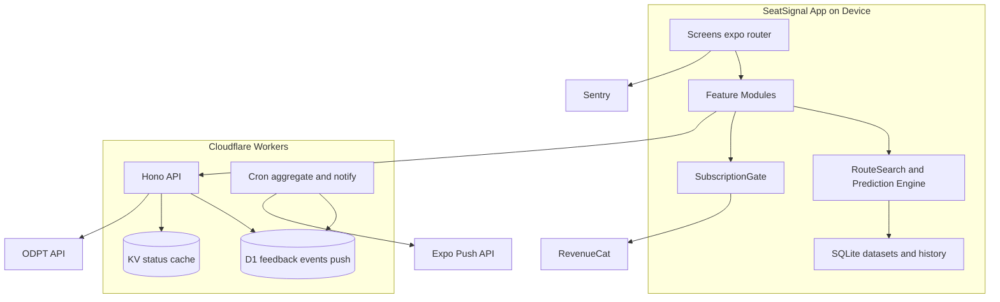
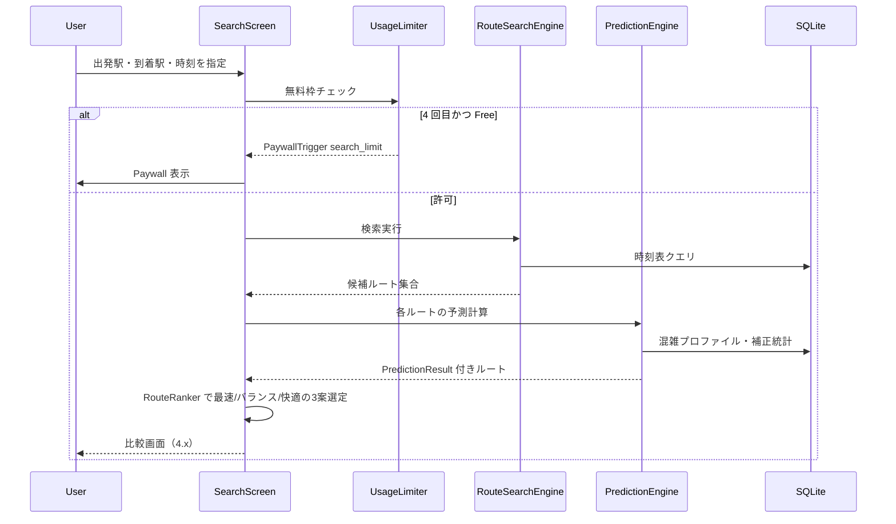
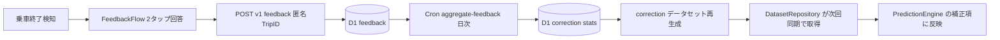
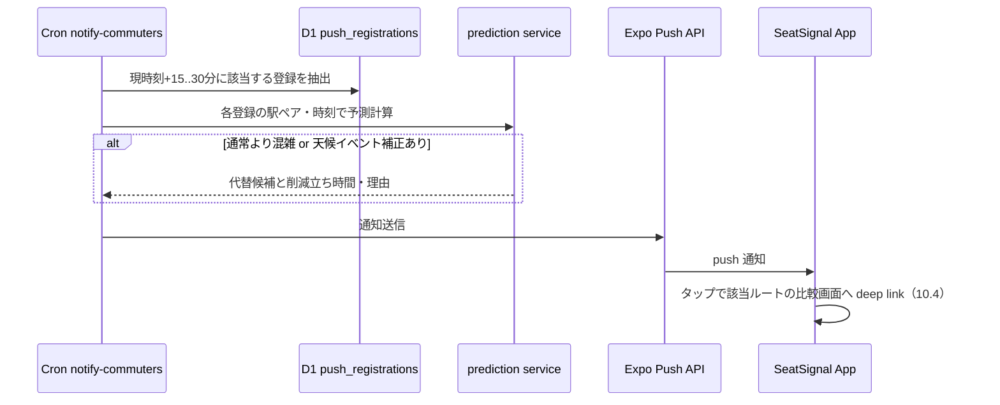

# Technical Design — seat-signal

## Overview

**Purpose**: SeatSignal は、公共交通の経路検索に「予想立ち時間」という快適性指標を導入し、最速・バランス・最も快適の 3 ルート比較と乗車位置案内を提供する iOS 優先のモバイルアプリである。本設計は、既存の Expo + Cloudflare Workers モノレポ・スキャフォールドの上に、端末内予測エンジン・データセット配信・匿名フィードバック集約・RevenueCat サブスクリプションを実装するための技術構造を定義する。

**Users**: 東京の対象区間を平日に通勤・通学するユーザーが、検索 → 比較 → 乗車 → フィードバックのループで利用する。運用者は集約データでファネルと予測誤差を測定する。

**Impact**: 現状のテンプレートコードを置き換え、`apps/frontend` に機能実装、`apps/backend` に API・Cron、`packages/shared` に API 契約型を新設する。

### Goals
- 検索・予測・比較・詳細案内・フィードバックの中核ループを端末内計算で成立させる（プライバシー・決定性・オフライン耐性を構造的に担保）
- RevenueCat による Free/Pro プラン制御・Paywall・購入/復元をクライアント SDK 完結で実装する
- 匿名フィードバックの集約と予測補正、ファネル計測、スマート通知を薄い Workers バックエンドで提供する
- Shipaton 期間内のストア審査通過に必要な品質項目（削除導線・帰属表示・多言語）を最初から組み込む

### Non-Goals
- 席の予約・売買、個人単位の降車予測、座席単位リアルタイム空席マップ（requirements Out of scope）
- 機械学習による予測、リアルタイム号車別混雑データ連携
- サーバ側での entitlement 検証（Webhook 連携）— 将来拡張とする
- Android / Web の最適化（ビルドは通すが検証は iOS 優先）

## Boundary Commitments

### This Spec Owns
- SeatSignal アプリの全クライアント機能（オンボーディング〜レポート、Paywall、設定）
- 予測データセットのスキーマとその配信 API、端末内ルート検索・予測エンジン
- 匿名フィードバック・分析イベントの収集 API と D1 スキーマ、集約 Cron
- `apps/backend/openapi.yaml`（zod スキーマから自動生成する API 仕様書。Postman 検証の入力）
- スマート通知の登録 API・配信 Cron
- `packages/shared` の全共有コード: API 契約型（zod スキーマ）、ドメイン定数（予測係数・プラン制限・保持期間）、エラーコード/AppError/Result、予測スコアリング純粋関数、共通ユーティリティ（時間バケット・zod パースヘルパ）

### Out of Boundary
- 混雑プロファイルの元データ整備作業そのもの（実走調査・ODPT からのデータセットビルドスクリプトの運用実行）— スキーマと格納形式のみ本スペックが定義
- RevenueCat ダッシュボード上の商品・Offering・Paywall テンプレート設定、App Store Connect の商品登録（運用手順であり、コードは entitlement `pro` の参照のみ）
- ストア提出物（説明文・スクリーンショット）の制作、審査対応
- プライバシーポリシー・利用規約の文面作成（アプリはリンク導線のみ提供）

### Allowed Dependencies
- ODPT API — backend からのみアクセス（トークン秘匿）。クライアントは ODPT を直接呼ばない
- RevenueCat SDK（`react-native-purchases` / `-ui`）— クライアントのみ。参照は `features/subscription` に閉じる
- Expo Push API — backend の通知 Cron からのみ
- Sentry — クライアントのクラッシュ計測のみ
- Cloudflare D1 / KV — backend のみ。クライアントは HTTP API 経由
- `packages/shared` — frontend / backend 双方から import 可（逆方向の依存は禁止）

### Revalidation Triggers
- データセットスキーマ（`dataset.schema.ts`）の破壊的変更 → クライアント・データセットビルドスクリプト双方の再検証
- API パス・リクエスト/レスポンス形状の変更 → `packages/shared` のスキーマ変更として PR で明示
- entitlement 識別子 `pro` や Free 制限値（3 回/日、保存 1 件）の変更 → Paywall・計測イベントの再検証
- 通知登録に保存する項目の追加 → プライバシー表記・ストア申告の再確認
- `packages/shared` のエラーコード・定数・スコアリング関数の変更 → frontend / backend 双方のビルドとテスト（golden テスト含む）の再実行。shared にプラットフォーム依存コード（RN / Node / Workers API）が混入した場合は境界違反として差し戻す

## Architecture

### Architecture Pattern & Boundary Map

採用パターン: **端末内計算＋データセット配信**（評価と代替案は research.md 参照）。クライアントが検索・予測・履歴管理を担い、backend はデータ配信・匿名収集・通知に限定される。



**Architecture Integration**:
- ドメイン境界: クライアントは `features/<domain>` 単位（feature-sliced）、backend は `routes/ → services/ → db/` の層構造
- 既存パターン維持: expo-router のファイルベースルーティング、Hono 単一アプリインスタンス、`CloudflareBindings` 型生成、Biome、kebab-case
- Steering 準拠: strict TypeScript、`@/` エイリアス、シークレットは Workers env のみ

**依存方向（クライアント）**: `packages/shared` → `lib/`（db, api, analytics, i18n）→ `features/` → `app/`（ルート）。左から右へのみ import 可。`features` 間の直接依存は禁止し、共有が必要な型・状態は `lib/` へ降ろす。

**依存方向（backend）**: `packages/shared` → `db/` → `services/` → `routes/`・`cron/`。

### Technology Stack

| Layer | Choice / Version | Role in Feature | Notes |
|-------|------------------|-----------------|-------|
| Frontend | Expo SDK 57 / RN 0.86 / React 19（既存） | アプリ本体 | Expo Go では課金以外を開発、EAS dev build で課金検証 |
| ナビゲーション | expo-router ~57（既存） | 画面ルーティング | ファイルベース |
| 状態管理 | zustand 5.x | プリファレンス・セッション状態 | kv-store へ persist |
| サーバデータ | @tanstack/react-query 5.x | API フェッチ・キャッシュ | データセット同期・運行情報 |
| ローカル DB | expo-sqlite ~57（+ kv-store） | データセット・履歴・使用量カウンタ | オフライン閲覧の基盤 |
| 課金 | react-native-purchases / -ui 10.6.x | 購入・復元・Paywall UI | entitlement `pro`。dev build 必須 |
| 通知 | expo-notifications ~57 | 通知受信・許可管理 | 配信は backend から |
| i18n | i18next 26.x + expo-localization | 日英切替（14.x） | 即時反映 |
| クラッシュ | @sentry/react-native 8.x | 15.4 | Expo config plugin |
| Backend | Hono 4.x on Cloudflare Workers（既存） | データ配信・収集・通知 API | |
| Data | D1（新規バインディング） | feedback / events / push 登録 / 集約統計 | `cf-typegen` 再生成必須 |
| Cache | Workers KV（新規バインディング） | ODPT 運行情報キャッシュ（TTL 60s） | |
| スケジュール | Workers Cron Triggers | 集約（日次）・通知（*/5 分） | |
| 契約型 | zod 4.x（packages/shared） | API 入出力の実行時検証と型共有 | security.md の境界検証 |
| API 仕様書 | @hono/zod-openapi 1.5.x + yaml 2.x | zod スキーマから `openapi.yaml` を自動生成（Postman 検証用） | 手書き仕様書は作らない — zod が単一の真実 |
| E2E 自動化 | @playwright/test 1.62.x | Expo **web ターゲット**に対する中核 UI フローの自動 E2E | ネイティブ専用機能（sandbox 課金・push 通知）は対象外 — 実機 E2E で担保 |

## File Structure Plan

### Directory Structure

```
packages/shared/                  # frontend / backend 共通コード。純粋 TypeScript のみ
├── package.json                  # （RN API・Node API・Workers API への依存を禁止。依存は zod のみ）
└── src/
    ├── index.ts                  # 公開エクスポート（バレル）
    ├── schemas/
    │   ├── api.schema.ts         # API リクエスト/レスポンスの zod スキーマ
    │   ├── dataset.schema.ts     # データセット（時刻表・混雑プロファイル・補正統計）スキーマ
    │   └── analytics-events.ts   # 17.1/17.2 のイベント名・プロパティ定義（単一の真実）
    ├── constants/
    │   ├── prediction.ts         # 加算式係数・信頼度閾値・レンジ切替閾値（5.3/5.4 の単一定義）
    │   ├── plan-limits.ts        # entitlement ID `pro`・Free 制限値（検索 3 回/日, 保存 1 件）
    │   └── retention.ts          # feedback 保持 90 日・k 匿名閾値 n>=5（16.2/16.3）
    ├── errors/
    │   ├── error-codes.ts        # 全エラーコードの判別ユニオン定数（ApiError/PredictionError 等の code 一覧）
    │   ├── error-messages.ts     # エラーコード → i18n messageKey のマップ（文言実体は locales/ 側 — 14.3）
    │   └── app-error.ts          # AppError 型・ファクトリ・型ガード（isAppError / toAppError）
    ├── prediction/
    │   └── scoring.ts            # 加算型スコアリングの純粋関数（データを引数で受け取る）
    ├── result.ts                 # Result<T, E> ユーティリティ（code-style.md 準拠）
    └── utils/
        ├── time.ts               # 15 分粒度時間帯バケット変換・day_type 判定（feedback/予測/集約で共用）
        └── validation.ts         # zod safeParse → Result<T, AppError> 変換ヘルパ

apps/backend/
├── openapi.yaml                  # 生成物（コミット対象）。Postman に直接インポートして API 検証に使う
├── scripts/
│   └── generate-openapi.ts       # OpenAPIHono から openapi.yaml を書き出す（`pnpm --filter backend openapi`）
└── src/
    ├── index.ts                  # OpenAPIHono アプリ組立て・ルート登録・scheduled ハンドラ（既存を置換）
    │                             # dev では GET /doc で OpenAPI JSON を配信（Postman の URL インポートにも対応）
    ├── routes/                   # 各ルートは createRoute（@hono/zod-openapi）で定義し、shared スキーマを参照
    │   ├── datasets.ts           # GET /v1/datasets/:name — 版チェック付きデータセット配信
    │   ├── train-status.ts       # GET /v1/train-status/:railwayId — ODPT プロキシ + KV キャッシュ
    │   ├── feedback.ts           # POST /v1/feedback — 匿名フィードバック受付
    │   ├── events.ts             # POST /v1/events — 分析イベントバッチ受付
    │   └── push-registrations.ts # PUT/DELETE /v1/push-registrations/:id — 通知登録
    ├── services/
    │   ├── odpt-client.ts        # ODPT API 呼び出し（トークンは env）
    │   ├── prediction.ts         # 通知用予測（shared の scoring 純粋関数に D1 のデータを渡す接続層）
    │   ├── feedback-aggregator.ts # フィードバック → 補正統計・誤差指標の集約ロジック
    │   └── push-sender.ts        # Expo Push API 送信
    ├── cron/
    │   ├── aggregate-feedback.ts # 日次: 補正統計データセットの再生成（8.8, 5.9）
    │   └── notify-commuters.ts   # */5: 通知ウィンドウ抽出→予測→送信（10.1–10.3）
    └── db/
        ├── schema.sql            # D1 スキーマ（migrations 兼用）
        └── queries.ts            # 型付きクエリ関数（parameterized のみ）

apps/frontend/src/
├── app/
│   ├── _layout.tsx               # ルート: Provider 群（i18n, Query, Purchases 初期化, Theme）
│   ├── onboarding.tsx            # 1.x オンボーディング（3 画面ページャ）
│   ├── (tabs)/
│   │   ├── _layout.tsx           # タブ: ホーム / レポート / 設定
│   │   ├── index.tsx             # ホーム: 検索フォーム・保存ルート・最近の検索
│   │   ├── report.tsx            # 11.x 週間レポート
│   │   └── settings.tsx          # 16.6 設定ハブ
│   ├── results.tsx               # 4.x 3 ルート比較
│   ├── route-detail.tsx          # 6.x ルート詳細・乗車位置案内
│   ├── coach.tsx                 # 7.x Live Comfort Coach
│   ├── feedback.tsx              # 8.x 乗車結果フィードバック
│   ├── paywall.tsx               # 12.x Paywall（RevenueCatUI をラップ）
│   └── settings/
│       ├── privacy.tsx           # 16.x データ共有・履歴削除
│       ├── notifications.tsx     # 10.5 通知頻度・時間帯
│       └── licenses.tsx          # 18.3 帰属表示
├── features/
│   ├── search/
│   │   ├── route-search-engine.ts    # 時刻表グラフ探索（対象区間限定）
│   │   ├── use-route-search.ts       # 検索実行 hook（無料枠チェック→検索→3案選定）
│   │   ├── recent-searches.ts        # 3.4 最近の検索（kv-store）
│   │   └── route-ranker.ts           # 2.3/4.1 プリファレンス反映の 3 案選定
│   ├── prediction/
│   │   ├── prediction-engine.ts      # 加算型スコアリング・信頼度・レンジ判定（5.x）
│   │   ├── explanation.ts            # 5.6/5.7 理由説明生成
│   │   └── types.ts                  # PredictionResult ほかドメイン型
│   ├── dataset/
│   │   ├── dataset-repository.ts     # データセット同期・SQLite 格納・版管理（5.8, 15.2）
│   │   └── use-dataset-sync.ts       # 起動時/定期同期 hook
│   ├── preferences/
│   │   └── preference-store.ts       # 2.x zustand ストア（persist）
│   ├── coach/
│   │   ├── coach-session.ts          # 7.x セッション状態機械（位置あり/なし推定）
│   │   └── use-train-status.ts       # 遅延情報ポーリング（react-query）
│   ├── feedback/
│   │   └── use-feedback.ts           # 8.x 送信・Trip ID 管理
│   ├── saved-routes/
│   │   └── saved-routes-store.ts     # 9.x 保存ルート CRUD（SQLite）＋Free 1 件制限
│   ├── subscription/
│   │   ├── subscription-gate.ts      # 12.x/13.x entitlement 判定・PaywallTrigger 発火
│   │   ├── usage-limiter.ts          # 12.1/12.2 日次検索カウンタ（kv-store）
│   │   └── use-purchases.ts          # 13.x 購入・復元・CustomerInfo 監視
│   ├── notifications/
│   │   └── push-registration.ts      # 10.x トークン取得・登録 API 呼び出し
│   ├── report/
│   │   └── use-weekly-report.ts      # 11.x ローカル履歴からの週次集計
│   └── trip-history/
│       └── trip-history-repository.ts # 乗車履歴の端末内保存・削除（11 の元データ, 16.5）
├── lib/
│   ├── api-client.ts             # backend API クライアント（zod 検証・Result 型）
│   ├── db.ts                     # expo-sqlite 初期化・マイグレーション
│   ├── analytics.ts              # 17.x イベントバッファ・バッチ送信
│   └── i18n.ts                   # 14.x i18next 初期化（shared の error-messages マップを文言解決に使用）
├── locales/
│   ├── ja.json                   # 日本語文言
│   └── en.json                   # 英語文言
└── components/                   # 既存 + 追加の共有 UI（route-card, prediction-badge 等）

apps/frontend/e2e/                # Playwright E2E シナリオ（web ターゲット対象、testID ベースのセレクタ）
apps/frontend/playwright.config.ts # expo web 起動と Workers dev / モック API を束ねる E2E 設定
```

### Modified Files
- `.github/workflows/ci.yml` — 新規: main への push / PR で Biome チェック・型チェック・Vitest（shared / backend / frontend）・OpenAPI ドリフト検証を実行する CI パイプライン
- `apps/backend/src/index.ts` — テンプレートを置換し、ルート登録・`scheduled` エクスポート・CORS を実装
- `apps/backend/wrangler.jsonc` — D1 / KV バインディング、Cron Triggers、`ODPT_TOKEN` シークレット宣言 → `cf-typegen` 再実行
- `apps/frontend/src/app/_layout.tsx` — Provider 組み込み・オンボーディング分岐（1.5）
- `apps/frontend/package.json` — 依存追加（`npx expo install` 経由）
- `pnpm-workspace.yaml` — `packages/*` は既存定義で包含（変更不要なら現状維持）

> 既存テンプレートの `explore.tsx`・デモ用コンポーネントは削除対象。削除は knip で未使用を確認して実施する。

## System Flows

### 検索〜比較〜詳細（中核ループ）



- 検索・予測は完全に端末内で完結し、分析イベント（17.1）のみ非同期送信する
- 対象区間外はエンジンが `out_of_area` エラーを返し、画面が 3.2 の表示を行う

### フィードバック収集と予測補正



- Trip ID は乗車開始時にクライアントが生成する UUID。ユーザー識別子・位置情報は送らない（8.6, 16.2, 17.5）
- 集約は最小サンプル数（k=5）未満のセルを出力しない（16.3）

### スマート通知（サーバプッシュ）



### 購入・復元（RevenueCat）

RevenueCat SDK の標準フローに従うため図は省略する。要点: `_layout.tsx` で `Purchases.configure()` → `CustomerInfo` リスナーで `SubscriptionGate` の zustand 状態を更新（13.3, 13.5, 13.8）。購入は `RevenueCatUI.presentPaywall()` の結果で判定し、`userCancelled` はエラー扱いしない（13.6）。商品取得失敗は Result 型でラップし再試行 UI を出す（13.7）。

Paywall テンプレート（RevenueCat ダッシュボード構成）には次を含める: 月額 ¥680 / 年額 ¥5,400（月あたり換算表示付き）と 7 日間トライアルの提示（13.1, 13.2）、Free/Pro 機能比較と削減立ち時間の価値提示（12.6）、プライバシーポリシー・利用規約リンク（13.9）、自動更新条件と解約方法の明示（13.10）、「購入を復元」ボタン（13.4）。テンプレートで表現できない項目は `paywall.tsx` 側のフッターで補完する。

## Requirements Traceability

| Requirement | Summary | Components | Interfaces / Flows |
|-------------|---------|------------|--------------------|
| 1.1–1.5 | オンボーディング | `onboarding.tsx`, `_layout.tsx` 分岐 | kv-store フラグ `onboarding_completed` |
| 2.1–2.4 | 快適性プリファレンス | `preference-store.ts`, 設定画面 | `ComfortPreference` 型 → RouteRanker |
| 3.1–3.5 | ルート検索 | `route-search-engine.ts`, `use-route-search.ts`, `recent-searches.ts` | 検索フロー図 |
| 4.1–4.4 | 3 ルート比較 | `route-ranker.ts`, `results.tsx`, `route-card` | `RankedRoutes` 型 |
| 5.1–5.9 | 予測提示 | `prediction-engine.ts`, `explanation.ts`, `dataset-repository.ts`(5.8), `feedback-aggregator.ts`(5.9) | `PredictionResult` 型 |
| 6.1–6.4 | ルート詳細・乗車位置 | `route-detail.tsx`, `prediction-engine.ts`（駅別確率）| `BoardingAdvice` 型（号車単位のみ, 6.3） |
| 7.1–7.6 | Live Comfort Coach | `coach-session.ts`, `use-train-status.ts`, `coach.tsx` | `GET /v1/train-status`, セッション状態機械 |
| 8.1–8.8 | フィードバック | `use-feedback.ts`, `feedback.tsx`, backend `feedback.ts`, `aggregate-feedback.ts` | `POST /v1/feedback`, 補正フロー図 |
| 9.1–9.6 | 通勤ルート保存 | `saved-routes-store.ts`, ホーム画面 | Free 1 件制限 → `SubscriptionGate`。タップで保存条件を `use-route-search` へ渡し即検索（9.5）。削除は 5 秒 Undo スナックバー（9.6） |
| 10.1–10.5 | スマート通知 | `push-registration.ts`, `notifications.tsx`, backend `push-registrations.ts`, `notify-commuters.ts`, `prediction.ts`, `push-sender.ts` | `PUT /v1/push-registrations`, 通知フロー図 |
| 11.1–11.4 | 週間レポート | `use-weekly-report.ts`, `trip-history-repository.ts`, `report.tsx` | 端末内集計（サーバ送信なし） |
| 12.1–12.6 | Free 制限と Paywall | `usage-limiter.ts`, `subscription-gate.ts`, `paywall.tsx` | `PaywallTrigger` 型 |
| 13.1–13.10 | 購入・復元 | `use-purchases.ts`, `subscription-gate.ts`, `paywall.tsx` | RevenueCat SDK（entitlement `pro`） |
| 14.1–14.3 | 多言語・外観 | `lib/i18n.ts`, `locales/*`, `use-theme.ts` 拡張 | i18next 言語切替は即時反映 |
| 15.1–15.5 | オフライン・エラー | `api-client.ts`(Result), `dataset-repository.ts`(15.2), Sentry(15.4), 共有エラー UI | Error Handling 章 |
| 16.1–16.7 | プライバシー | 端末内計算全般, `trip-history-repository.ts`(16.5), `privacy.tsx`, `settings.tsx`(16.6), backend 集約 k 匿名(16.3) | データ最小化は API スキーマで強制 |
| 17.1–17.5 | 計測 | `lib/analytics.ts`, `analytics-events.ts`(shared), backend `events.ts` | `POST /v1/events` |
| 18.1–18.6 | ストア公開品質 | `privacy.tsx`(18.1 削除導線), `settings.tsx`(18.2), `licenses.tsx`(18.3), sandbox 検証(18.5), 主要フロー実機動作(18.6) | 18.4 はコード外（Out of Boundary） |

## Components and Interfaces

| Component | Layer | Intent | Req | Key Dependencies | Contracts |
|-----------|-------|--------|-----|------------------|-----------|
| DatasetRepository | frontend/lib-adjacent | データセット同期・版管理・SQLite 格納 | 5.8, 15.2, 3.1 | api-client (P0), db (P0) | Service, State |
| RouteSearchEngine | frontend/domain | 時刻表ベース経路探索（対象区間） | 3.x | DatasetRepository (P0) | Service |
| PredictionEngine | frontend/domain | 立ち時間・着座予測・信頼度・理由 | 4.2, 5.x, 6.2 | DatasetRepository (P0) | Service |
| RouteRanker | frontend/domain | 3 案選定・プリファレンス反映 | 2.3, 4.1 | PredictionEngine (P0) | Service |
| CoachSession | frontend/domain | 乗車中の状態機械・予測更新 | 7.x | PredictionEngine (P0), train-status API (P1) | Service, State |
| SubscriptionGate | frontend/domain | entitlement 判定・Paywall トリガー | 9.3, 12.x, 13.x | react-native-purchases (P0), UsageLimiter (P0) | Service, State |
| UsageLimiter | frontend/domain | 日次検索カウンタ | 12.1, 12.2 | kv-store (P0) | Service |
| AnalyticsClient | frontend/lib | イベントバッファ・バッチ送信 | 17.x | api-client (P1) | Service |
| ApiClient | frontend/lib | HTTP + zod 検証 + Result | 15.1, 15.5 | shared schemas (P0) | Service |
| Datasets API | backend/route | データセット配信 | 5.8, 15.2 | KV/静的アセット (P0) | API |
| TrainStatus API | backend/route | ODPT プロキシ + キャッシュ | 7.3 | ODPT (P0), KV (P0) | API |
| Feedback API + Aggregator | backend | 匿名収集と日次集約 | 8.x, 5.9, 16.3 | D1 (P0) | API, Batch |
| Events API | backend/route | 分析イベント収集 | 17.x | D1 (P0) | API |
| PushRegistrations API + NotifyCron | backend | 通知登録・配信 | 10.x | D1 (P0), Expo Push (P0) | API, Batch |

画面コンポーネント（onboarding / results / route-detail / coach / feedback / paywall / report / settings 各画面）は上記ドメインコンポーネントの表示層であり、サマリ行のみとする。以下、新しい境界を導入するコンポーネントの詳細を示す。

### Frontend Domain

#### PredictionEngine

| Field | Detail |
|-------|--------|
| Intent | ルート区間ごとの予想立ち時間・着座確率・信頼度・理由を決定的に算出する |
| Requirements | 4.2, 5.1–5.8, 6.2, 6.3, 7.2 |

**Responsibilities & Constraints**
- 加算型スコア: 基礎混雑プロファイル + 補正項（曜日種別・天候/イベント係数・フィードバック補正統計）。各項の寄与値を保持し `explanation.ts` が理由文を生成する（5.6）
- 同一入力（ルート・時刻・データセット版）に対して同一出力（5.2）。乱数・現在時刻への暗黙依存を持たない
- サンプル数が閾値未満のセルは信頼度 `low` とし、出力をレンジ表現に切替（5.3, 5.4）。閾値は定数モジュールで一元管理
- 号車単位の粒度のみ扱う。ドア単位のフィールドは型に存在しない（6.3）
- 出力・理由文はすべて号車/エリア単位の集団統計として表現する。`messageKey` の文言セット（locales）に個人の降車を示唆する文言を含めない（7.6）。断定形ではなく確率・見込み表現の文言キーのみを用意する（5.5）

##### Service Interface
```typescript
type Confidence = "low" | "medium" | "high";

type PredictionResult = {
  standingMinutes: { point: number } | { rangeMin: number; rangeMax: number };
  seatedMinutes: number;
  seatProbability: number; // 0..1
  perStationSeatProbability: ReadonlyArray<{ stationId: string; probability: number }>;
  confidence: Confidence;
  sampleSizeHint: string; // 5.3 データ件数の目安表示用
  factors: ReadonlyArray<PredictionFactor>; // 5.6 使用要素のみ
  comfortScore: number;
};

type PredictionFactor = {
  kind: "base_profile" | "day_type" | "weather" | "event" | "feedback_correction" | "delay";
  contribution: number;
  messageKey: string; // i18n キー
};

interface PredictionEngine {
  predictLeg(input: {
    railwayId: string;
    fromStationId: string;
    toStationId: string;
    departure: string; // ISO local
    carNumber?: number;
  }): Promise<Result<PredictionResult, PredictionError>>;
  recommendBoarding(input: { trainLegId: string }): Promise<Result<BoardingAdvice, PredictionError>>;
}

type PredictionError =
  | { type: "dataset_missing" }        // 15.3 予測データ不足 → 時刻表のみ表示へ
  | { type: "insufficient_data" };     // 5.7 データ不足表示
```
- Preconditions: 対象データセットが SQLite に同期済み
- Postconditions: `factors` は実際に加算された項のみを含む
- Invariants: 同一入力＋同一データセット版 → 同一出力

**Implementation Notes**
- Integration: RouteRanker・RouteDetail・CoachSession・backend `prediction.ts`（通知用）が同一の加算式を使う。スコアリング本体は `packages/shared/prediction/scoring.ts` の純粋関数（データは引数渡し）、係数・閾値は `packages/shared/constants/prediction.ts` に置き、クライアント/サーバの二重実装を排除する。PredictionEngine はデータ取得（SQLite）と scoring の接続層になる
- Validation: golden テスト（既知データセットに対する期待値表）で決定性を担保
- Risks: 初期プロファイルの精度。→ 8.8 の補正ループと 5.9 の誤差測定で監視

#### SubscriptionGate

| Field | Detail |
|-------|--------|
| Intent | entitlement `pro` の判定と Paywall トリガー発火を一元化する |
| Requirements | 9.2–9.4, 12.1–12.6, 13.3, 13.8 |

**Responsibilities & Constraints**
- Pro 判定の唯一の参照点。UI は `useIsPro()` と `guard(feature)` のみ使用し、`react-native-purchases` を直接 import しない
- Expo Go（Preview API Mode）ではモック CustomerInfo で動作し、開発を阻害しない

##### Service Interface
```typescript
type PaywallTrigger =
  | { type: "search_limit" }            // 12.2
  | { type: "pro_feature"; feature: "boarding_detail" | "full_station_prediction" | "coach" | "detailed_report" } // 12.4
  | { type: "saved_route_limit" };      // 9.3

interface SubscriptionGate {
  isPro(): boolean;                                  // CustomerInfo キャッシュ由来
  guard(trigger: PaywallTrigger): { allowed: true } | { allowed: false; trigger: PaywallTrigger };
  onEntitlementChange(cb: (isPro: boolean) => void): () => void; // 13.3, 13.8
}
```
- Invariants: 初回起動直後に Paywall を出すトリガーは存在しない（12.5 — トリガー型が行動起点のみで構成される）

**Implementation Notes**
- Integration: `guard` が `allowed: false` を返した画面は `paywall.tsx` へ遷移し、trigger 種別を分析イベント（17.3）に付与
- Validation: trigger 種別ごとの表示数・転換の計測をユニットテストで検証
- Risks: 無料枠カウンタ（UsageLimiter, kv-store の `date + count`）は改ざん耐性が低い — MVP 許容（research.md）

#### DatasetRepository

| Field | Detail |
|-------|--------|
| Intent | バージョン付きデータセットの同期・SQLite 格納・提供 |
| Requirements | 3.1, 5.8, 15.2, 15.3 |

**Responsibilities & Constraints**
- データセット種別: `timetable`（時刻表・駅・路線）/ `congestion`（混雑プロファイル）/ `correction`（フィードバック補正統計）
- 起動時と 24h 間隔で `GET /v1/datasets/:name?since=<version>` を照会し、差分があれば全量置換（データ量が小さいため差分適用は行わない — 簡素化）
- 同期失敗時も既存データで動作継続（15.1, 15.2）。データセット未取得の路線は `dataset_missing` を返し 15.3 の UI 切替を促す

**Contracts**: Service / State（SQLite テーブル所有: `datasets_meta`, `timetable_*`, `congestion_profile`, `correction_stats`）

### Backend

#### Datasets / Feedback / Events / PushRegistrations API

| Field | Detail |
|-------|--------|
| Intent | クライアントとの全 HTTP 契約 |
| Requirements | 5.8, 5.9, 8.6, 10.1, 15.2, 16.2, 16.3, 17.1–17.5 |

##### API Contract
| Method | Endpoint | Request | Response | Errors |
|--------|----------|---------|----------|--------|
| GET | /v1/datasets/:name?since=v | — | `{ version, notModified? , payload? }` | 400, 404, 500 |
| GET | /v1/train-status/:railwayId | — | `{ status, delayMinutes, fetchedAt }`（KV 60s キャッシュ） | 404, 502 |
| POST | /v1/feedback | `FeedbackPayload`（tripId, railwayId, legKey, boardedAt 時間帯, seatedOutcome, seatedStationId?, vsExpected?, predictedStandingMin） | `{ ok: true }` | 400, 500 |
| POST | /v1/events | `{ events: AnalyticsEvent[] }`（最大 20 件） | `{ accepted: number }` | 400, 413, 500 |
| PUT | /v1/push-registrations/:id | `{ expoPushToken, fromStationId, toStationId, weekdays, notifyAt, leadMinutes, locale }` | `{ ok: true }` | 400, 500 |
| DELETE | /v1/push-registrations/:id | — | `{ ok: true }` | 404, 500 |

- 全エンドポイントで zod（`packages/shared/schemas/api.schema.ts`）によるパースを行い、スキーマ外フィールドは reject する（17.5 のデータ最小化を構造で強制。位置情報・ユーザー識別子のフィールド自体が存在しない）

##### OpenAPI 仕様書（Postman 検証用）

`apps/backend/openapi.yaml` を第一級の設計成果物として扱う。手書きはせず、`@hono/zod-openapi` の `createRoute` でルートを定義し、`scripts/generate-openapi.ts` が OpenAPI ドキュメントを YAML 化してコミットする（ルート定義と仕様書のドリフトが構造的に起きない）。**Postman へそのままインポートして全エンドポイントを叩ける精度**を受け入れ条件とし、以下を必須とする:

- **OpenAPI 3.0 系**で出力（Postman インポート互換性を最優先）。`info.title` = `SeatSignal API`、`info.version` は API バージョンと同期
- `servers` に `http://localhost:8787`（wrangler dev）と本番 Workers URL の 2 件を定義 — Postman 側で環境切替できる
- 全ルートに `operationId`（例: `getDataset`, `postFeedback`）・`summary`・`tags`（`datasets` / `feedback` / `events` / `push` / `status`）を付与
- 全リクエスト/レスポンススキーマに **`example` と `description` を付与** — `packages/shared` 側は zod 4 ネイティブの `.meta()` で定義し（shared の「依存は zod のみ」制約を維持）、backend のルート定義がそれを OpenAPI へ変換する。Postman はこの example からサンプルペイロードを自動生成できる
- エラーレスポンスは全ルートで `{ error: { code } }` 形状を `components.schemas.ErrorResponse` として共有定義し、各ステータス（400/401/404/413/500）に紐付ける
- `components.securitySchemes` に `apiKey`（header `x-api-key`）を定義し全ルートへ適用 — Postman の Collection 変数でキーを一元設定できる
- パスパラメータ（`:name`, `:railwayId`, `:id`）は enum または pattern・example 付きで定義する
- `FeedbackPayload.boardedAt` は時刻でなく 15 分粒度の時間帯バケット（16.2 の再識別リスク低減）
- 認証: MVP では App 側共有キー（`x-api-key`）+ レート制限（IP 単位）。個人認証は行わない（アカウントレス設計）

##### Batch / Job Contract（Cron）
- `aggregate-feedback`（daily 03:00 JST）: feedback → `correction_stats` 再計算（セルは railway×leg×時間帯×曜日種別、n≥5 のみ出力 — 16.3）。同時に予測誤差指標（MAE）を `metrics` テーブルへ記録（5.9）。冪等（全量再計算）
- `notify-commuters`（*/5）: `push_registrations` から `notifyAt - leadMinutes` ウィンドウ該当を抽出 → `services/prediction.ts` で予測 → 混雑増 or 補正要因ありなら理由付きで送信（10.2, 10.3）。送信済みフラグ（日付付き）で重複防止（冪等）。予測の入力データは **KV に格納したデータセット payload（時刻表・混雑プロファイル — Datasets API の配信元と同一）＋ D1 の `correction_stats`** であり、クライアントと同じ shared スコアリング関数に引数で渡す

**Implementation Notes**
- Integration: D1 バインディング `DB`、KV `STATUS_CACHE`、シークレット `ODPT_TOKEN`, `API_SHARED_KEY` を `wrangler.jsonc` に宣言し `cf-typegen` 再生成
- Validation: ルートごとの統合テスト（後述）。ODPT 障害時は train-status がキャッシュ済み値 + `stale: true` を返し、クライアントは案内を継続（7.4 と整合）
- Risks: ODPT 再配布条件がデータセット配信に抵触した場合は Datasets API を「都度整形」型へ変更（境界は Repository 層で吸収 — research.md）

## Data Models

### Domain Model（クライアント）
- **Route**（集約ルート）: `legs: TrainLeg[]` を持つ。`TrainLeg` は列車・乗車駅・降車駅・発着時刻・推奨号車。検索結果はイミュータブル
- **Trip**（乗車セッション集約）: `tripId (UUID)`, 選択ルート、開始/終了時刻、フィードバック結果。**端末内のみ**に保存され、`trip-history-repository` が所有。削除操作（16.5）はこの集約単位
- **ComfortPreference**（値オブジェクト）: `speedComfortBalance`, `maxExtraMinutes`, `transferTolerance`, `walkingTolerance`（2.4 — 身体情報フィールドなし）
- **PredictionResult**（値オブジェクト）: PredictionEngine 章の定義を全画面で共有

### Physical Data Model

**クライアント SQLite**（`lib/db.ts` がマイグレーション管理）
- `datasets_meta(name PK, version, synced_at)`
- `stations(id PK, railway_id, name_ja, name_en, seq)` / `train_timetables(train_id, station_id, dep_time, arr_time, car_count, day_type)`
- `congestion_profile(railway_id, leg_key, time_bucket, day_type, car_number, load_score, sample_n)`
- `correction_stats(railway_id, leg_key, time_bucket, day_type, delta_score, sample_n)`
- `trips(trip_id PK, route_json, started_at, ended_at, feedback_json)` — 履歴削除で DELETE
- kv-store: `onboarding_completed`, `preferences`, `usage_counter:{date}`, `recent_searches`, `locale`, `theme`

**D1**（`db/schema.sql`）
- `feedback(id PK, trip_id, railway_id, leg_key, time_bucket, day_type, seated_outcome, seated_station_id, vs_expected, predicted_standing_min, created_at)` — trip_id 以外に識別子なし。90 日で削除（16.2 の保持期間）
- `correction_stats(railway_id, leg_key, time_bucket, day_type, delta_score, sample_n, computed_at)`（PK: 複合）
- `metrics(date PK, railway_id, mae_standing_min, n)` — 5.9
- `analytics_events(id PK, name, props_json, session_id, created_at)` — props は shared スキーマ準拠のみ
- `push_registrations(id PK, expo_push_token, from_station_id, to_station_id, weekdays, notify_at, lead_minutes, locale, last_sent_date)`

### Data Contracts & Integration
- API 入出力・データセット payload・分析イベントはすべて `packages/shared` の zod スキーマが唯一の定義。フロント・バックはこれを import し、スキーマ変更 = 契約変更として扱う（Revalidation Trigger）
- データセット payload はスキーマバージョン (`schemaVersion`) を持ち、クライアントは未知バージョンを拒否して旧データで継続する（前方互換）

## Error Handling

### Error Strategy
- 期待される失敗（ネットワーク・対象外区間・データ不足・購入キャンセル）は `Result<T, E>` の判別可能ユニオンで表現し、throw しない（code-style.md 準拠）。`Result` 型・`AppError` 型・エラーコード定数・型ガードは `packages/shared/errors/` と `result.ts` に一元定義し、frontend / backend が同一のエラー語彙を使う
- `ApiClient` がオフライン検出（15.1）・タイムアウト・HTTP エラーを `error-codes.ts` の `ApiError` コード（`offline | timeout | server | invalid_response`）に正規化。backend のエラーレスポンスも同じコード体系（`{ error: { code } }`）で返す
- エラーコード → 表示文言は `errors/error-messages.ts` の messageKey マップ経由で解決し、文言実体は `locales/ja.json` / `en.json` に置く（14.3 の即時言語切替と両立）。各画面はエラー種別に応じた文言＋再試行ボタンを共有コンポーネント `error-state` で表示（3.3, 13.7, 15.5）

### Error Categories and Responses
- **User/入力系**: 対象区間外（3.2）→ 未対応区間の明示と対応区間一覧への誘導。検索条件不備 → フィールドレベル検証
- **System 系**: オフライン（15.1）→ バナー＋保存済み時刻表閲覧へ誘導（15.2）。ODPT 障害 → train-status は stale キャッシュで劣化継続（7.4）。backend 5xx → 再試行 UI
- **Business 系**: 無料枠超過・Pro 機能 → Paywall（エラーではなく導線として扱う）。予測データ不足（15.3）→ 「予測データ不足」表示＋時刻表のみモードへの切替オプション。購入キャンセル（13.6）→ 無反応で購入前状態維持

### Monitoring
- Sentry: クラッシュ・未捕捉例外（15.4）。分析イベントとは分離
- backend: `console.error` に操作名・キー ID を含めた構造化ログ（Workers observability）。シークレット・payload 全文はログしない（security.md）

## Testing Strategy

テストランナーは **Vitest** を導入（frontend はドメイン層のみ対象、backend は Workers 互換の `@cloudflare/vitest-pool-workers`）。ファイルは `foo.ts` → `foo.test.ts` 併置（testing.md 準拠）。GitHub Actions の CI（`.github/workflows/ci.yml`）が main への push / PR ごとに Biome チェック・型チェック・全ワークスペースの Vitest・OpenAPI ドリフト検証・Playwright E2E（web ターゲット）を実行する。

### Unit Tests（frontend ドメイン層）
1. `prediction-engine`: 同一入力＋同一データセット → 同一出力（5.2）／サンプル数閾値未満でレンジ表現＋低信頼度に切替（5.3, 5.4）／`factors` に加算した項のみ含まれる（5.6）
2. `route-ranker`: プリファレンス（速さ/バランス/快適 × 許容追加時間）の変更が 3 案の選定・順位に反映される（2.3, 4.1）
3. `usage-limiter` + `subscription-gate`: Free で 3 回目まで許可・4 回目で `search_limit` トリガー、日付切替でリセット、Pro では無制限（12.1, 12.2）／保存ルート 2 件目で `saved_route_limit`（9.2, 9.3）
4. `coach-session`: 位置情報なし時に時刻表＋経過時間で駅進行を推定する状態遷移（7.4）、到着前の降車案内発火（7.5）
5. `explanation`: データ不足時に「データ不足」文言キーを返す（5.7）

### Integration Tests（backend, vitest-pool-workers）
1. `POST /v1/feedback` → D1 保存 → `aggregate-feedback` 実行 → `correction_stats` に n≥5 セルのみ出力（8.6, 8.8, 16.3）、MAE が `metrics` に記録される（5.9）
2. `GET /v1/datasets/:name?since=v` の 304 相当（notModified）と更新時 payload 返却、zod スキーマ適合
3. `POST /v1/events` — スキーマ外フィールド（例: 緯度経度）を含むイベントの reject（17.5）と 20 件超の 413
4. `notify-commuters` — ウィンドウ抽出・重複送信防止（last_sent_date）・理由付き通知 payload 生成（10.1–10.3）
5. `GET /v1/train-status` — KV キャッシュヒット／ODPT 障害時の stale 応答
6. OpenAPI 同期: ルート定義から生成したドキュメントとコミット済み `openapi.yaml` の一致検証（ドリフト時にテスト失敗）。全ルートに operationId・example・ErrorResponse 参照が存在することのメタ検証

### E2E 自動テスト（Playwright — Expo web ターゲット）

`apps/frontend/e2e/` に Playwright シナリオを置き、CI で expo web ビルド＋ローカル Workers（またはモック API）に対して実行する。Playwright はブラウザ自動化のため対象は web ターゲットに限定し、ネイティブ専用機能は下記の実機 E2E で担保する。課金は `SubscriptionGate` のモック（Preview API Mode 相当）で Free / Pro 両状態を切り替えて検証する。

1. オンボーディング完了 → ホーム表示、再訪時にオンボーディングが出ない（1.1, 1.5）
2. 検索 → 3 ルート比較（全指標表示）→ 快適ルート選択の差分表示 → 詳細画面（3.1, 4.1–4.4, 6.1)
3. Free 状態で 4 回目検索 → Paywall 表示、Pro モック状態では非表示（12.1, 12.2）
4. 言語切替の即時反映と、オフライン（ネットワーク遮断）時のエラー表示・再試行（14.3, 15.1, 15.5）
5. フィードバックフローの 2 タップ送信 UI（8.1, 8.4）

### E2E / Manual QA（実機・dev build。argent による UI フロー検証）
1. 初回起動 → オンボーディング 3 画面 → 完了後ホーム、再起動で再表示なし（1.1, 1.5）
2. 検索 → 3 ルート比較 → 快適ルート選択 →「追加 N 分で M 分削減」表示 → 詳細 → 号車案内（3.x, 4.x, 6.1）— 18.6 の主要フロー前半
3. Free で 4 回目検索 → Paywall → sandbox 購入 → Pro 解放 → 再起動で権利維持 → 復元操作（12.2, 13.3–13.5, 18.5）
4. 乗車 → フィードバック 2 タップ送信（8.1–8.4）— 18.6 の主要フロー後半
5. 機内モードでオフラインバナー＋保存済み時刻表閲覧（15.1, 15.2）、言語切替の即時反映（14.3）

## Security Considerations
- ODPT トークン・API 共有キーは Workers シークレットのみ。クライアントバイナリに秘密情報を含めない
- アカウントレス設計: サーバ側にユーザー識別子を持たない。Trip ID は乗車ごとの UUID で、feedback 保持期間 90 日経過後に削除（16.2）
- API 境界の zod 検証＋D1 は parameterized query のみ（security.md）。`/v1/events`・`/v1/feedback` に IP レート制限
- 18.1 の「データ削除導線」= 端末内履歴削除（trips 全削除）+ push 登録 DELETE。サーバに残る匿名データは個人に紐づかないことをプライバシー画面に明記

## Performance & Scalability
- 検索＋3 案予測の端末内応答目標: < 1.5s（3.5 のローディング表示は 300ms 以上かかる場合のみ）
- データセット合計サイズ目標: < 5MB（対象 1〜3 路線）。超過時は路線単位の分割配信
- Workers: datasets は KV 配信でオリジン計算なし（データセットビルドスクリプトが KV へ投入し、Datasets API と通知 Cron が同一の KV payload を読む）。D1 書込はバッチ＋`waitUntil` で応答遅延を回避
