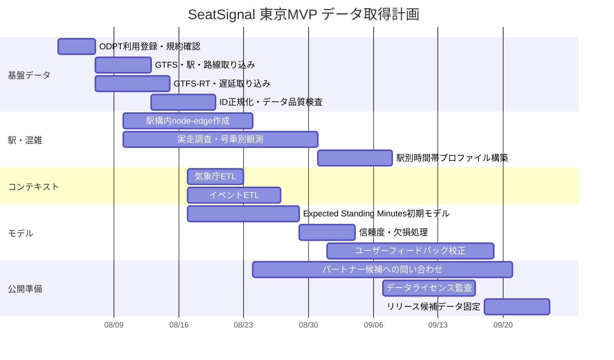
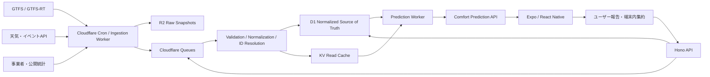
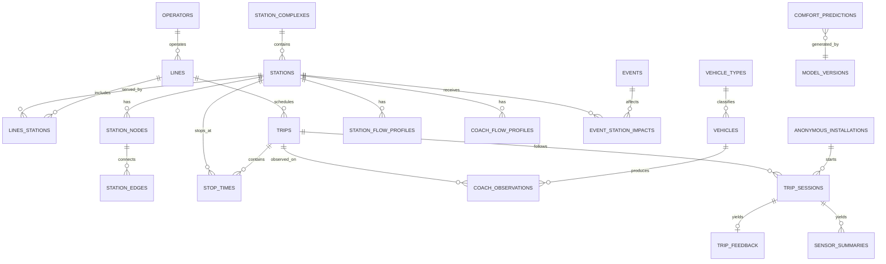

# SeatSignal

### 最速ではなく、「最も快適に移動できるルート」を提案するAI通勤アシスタント

## 概要

SeatSignalは、公共交通機関を利用するユーザーの**予想立ち時間と移動時の身体的・心理的負担を最小化するAI通勤アシスタント**です。

既存の経路検索アプリは、主に「最短時間」や「最安料金」を基準にルートを提案します。また、一部の交通アプリでは列車の混雑度や座りやすい号車を確認できます。

しかし、ユーザーが本当に知りたいのは、単なる車両の混雑状況ではありません。

- 目的地まで何分間立つ可能性があるのか
- 数分遅い列車を選ぶことで、どのくらい長く座れるのか
- どの列車、号車、乗車位置を選ぶべきか
- 乗車後、何駅先で座れる可能性が高まるのか
- 速さと快適さのどちらを優先すべきか

SeatSignalは、時刻表、乗降傾向、天候、イベント、遅延、匿名のユーザーフィードバックなどを組み合わせ、ユーザーごとに最適な移動方法を提案します。

席そのものを予約・確保するサービスではなく、**座れる可能性と移動負担を予測し、より快適な行動を支援するサービス**です。

---

## 課題と具体的な解決策

### 課題1：既存の経路検索は「到着時間」しか最適化していない

現在の経路検索サービスでは、最速、最安、乗換回数などを基準にルートが提案されます。

しかし、同じ30分の移動でも、

- 30分間ずっと立つルート
- 5分遅くなるが20分間座れるルート

では、ユーザーが感じる負担は大きく異なります。

特に、毎日通勤・通学する人、高齢者、子ども連れ、大きな荷物を持つ人、長時間立つことが難しい人にとって、快適性は移動時間と同じくらい重要です。

#### 解決策

検索結果に以下の指標を追加します。

- 予想立ち時間
- 予想着座時間
- 着座できる確率
- 混雑ストレス
- 乗換時の歩行負担
- 最速ルートとの差分時間
- 予測の信頼度

「最速」「バランス」「最も快適」の3つのルートを比較できるようにします。

---

### 課題2：混雑情報を見ても、具体的にどう行動すべきか分からない

既存サービスでは、「混雑している」「比較的空いている」といった情報は確認できます。

しかし、その情報だけでは、

- どの列車を選ぶべきか
- どの号車に乗るべきか
- 1本見送る価値があるか
- 急行と各駅停車のどちらがよいか

まで判断できません。

#### 解決策

SeatSignalは、混雑情報をそのまま表示するのではなく、具体的な行動に変換します。

例：

> 8:12発は到着が最も早いですが、予想立ち時間は27分です。
> 8:17発の各駅停車を選ぶと到着は5分遅くなりますが、予想立ち時間を8分まで短縮できます。

さらに、推奨する号車、ドア位置、ホーム上の待機位置も案内します。

---

### 課題3：乗車後に状況が変わっても案内が更新されない

乗車前の予測が正しくても、遅延、イベント、乗客の集中などによって状況は変化します。

既存の経路検索は、乗車後の「座れる可能性」を継続的に更新する設計になっていないことが多くあります。

#### 解決策

乗車後に利用できる「Live Comfort Coach」を提供します。

- 次の駅で座席回転が増える可能性
- 途中駅ごとの着座確率
- 遅延による予測変化
- 当初予測と現在の差
- 降車・乗換タイミング
- 次回以降の改善提案

個人を追跡したり、「目の前の人が降りる」と予測したりせず、号車やエリア単位の集団統計として案内します。

---

### 課題4：推薦が成功すると、全員が同じ号車へ集中する

一般的な推薦システムが、すべてのユーザーに「7号車が最も空いている」と案内すると、結果として7号車に利用者が集中します。

利用者が増えるほど、推薦精度が悪化する可能性があります。

#### 解決策

SeatSignalユーザーへの推薦状況も考慮し、利用者を複数の列車や号車へ分散します。

単純に最も空いている場所を提示するのではなく、

- 現在の混雑予測
- 同じ推薦を受け取った人数
- 号車間の混雑差
- ユーザーの乗換位置
- 推薦後に予測される混雑

をもとに、ユーザーごとに異なる選択肢を案内します。

---

### 課題5：個人の移動履歴や身体状況を扱うとプライバシーリスクが生じる

移動履歴、位置情報、利用路線、身体的な事情は、慎重に扱う必要があります。

#### 解決策

以下を基本方針とします。

- 個人向けの快適性計算は可能な限り端末内で実行
- 移動履歴を恒久的に保存しない
- 乗車中のみ有効な匿名Trip IDを使用
- サーバーには集約済みの統計情報のみを送信
- 少人数のデータを単独で表示しない
- 降車予定駅や身体情報を他のユーザーへ公開しない
- ユーザーが共有するデータを選択できるようにする

---

## MVPで目指すゴール

MVPの目的は、世界中のすべての鉄道路線へ対応することではありません。

**「最速ルートではなく、予想立ち時間を基準にルートを選ぶ」という体験に、ユーザーが価値を感じるかを検証すること**が最優先です。

### 対象範囲

- 対象都市：東京
- 対象路線：データを取得しやすい1〜3路線
- 対象ユーザー：平日に電車で通勤・通学する人
- 対応OS：iOSを優先
- 対応言語：日本語・英語

### MVPで検証する仮説

1. ユーザーは最速ルートだけでなく、快適なルートを選ぶ
2. 数分の到着遅延と引き換えに、立ち時間を減らしたい需要がある
3. 「着座確率」より「予想立ち時間」の方が価値を理解しやすい
4. 号車や乗車位置の案内が、実際の着座結果を改善する
5. 通勤前の通知によって継続利用される
6. 快適性の高いルート提案に対して課金意欲がある
7. 乗車後のフィードバックを継続的に収集できる

### MVPの成功指標

- 初回検索完了率
- 提案ルートの選択率
- 最速以外のルートを選んだ割合
- 予想立ち時間と実測値の誤差
- 乗車後フィードバック回答率
- 7日後・30日後の継続率
- 通勤ルート登録率
- 通知からのアプリ起動率
- 無料版から有料版への転換率
- 予想立ち時間の平均削減量

### MVPで実現したいユーザー体験

> SeatSignalを使ったことで、到着は5分遅くなったが、立っていた時間を20分減らせた。

この体験を1路線でも実証できれば、プロダクトの価値を十分に伝えられます。

---

## 機能一覧

### 1. 快適ルート検索

出発駅、到着駅、出発・到着時間を入力し、複数のルートを比較します。

表示する候補：

- 最速ルート
- バランスルート
- 最も快適なルート

各ルートに以下を表示します。

- 到着予定時刻
- 所要時間
- 乗換回数
- 予想立ち時間
- 予想着座時間
- 着座確率
- 混雑ストレス
- 快適性スコア
- 予測信頼度

---

### 2. 快適性の優先度設定

ユーザーが移動時に優先する条件を設定します。

- 到着時間
- 座りやすさ
- 立ち時間
- 乗換回数
- 歩行距離
- 混雑の少なさ
- 階段や長距離移動の回避

MVPでは、「速さ優先」と「快適さ優先」のスライダーに簡略化します。

---

### 3. 推奨列車・号車案内

選択したルートに対して、以下を表示します。

- 推奨する列車
- 推奨号車
- 推奨ドア
- ホーム上の待機位置
- 他の号車との比較
- 1本見送った場合の効果

---

### 4. 途中駅ごとの着座予測

各停車駅について表示します。

- 降車が増える可能性
- 座席回転が起きる可能性
- 着座確率の変化
- 座れるまでの予想時間

個人の降車行動ではなく、駅・時間帯・号車単位の統計として提供します。

---

### 5. Live Comfort Coach

乗車後に予測をリアルタイム更新します。

- 現在の列車位置
- 次の駅
- 現在の予想立ち時間
- 着座確率の変化
- 遅延や運行状況
- 次の大きな座席回転ポイント
- 降車・乗換通知

---

### 6. 通勤ルート登録

よく利用するルートを保存します。

- 自宅から勤務先
- 自宅から学校
- 帰宅ルート
- 曜日ごとのルート
- 通常の出発時間

登録したルートをもとに、アプリを開かなくても通知を受け取れます。

---

### 7. スマート通知

例：

- いつもの列車が通常より混雑している
- 1本後の列車の方が予想立ち時間が短い
- 雨やイベントによって混雑が増えている
- 通常とは異なる号車がおすすめ
- 帰宅時間帯で快適な列車が近づいている

通知はOneSignalなどと連携し、Shipatonの継続利用部門も狙います。

---

### 8. 乗車結果フィードバック

乗車後、簡単な操作で回答できます。

- 最初から座れた
- 途中から座れた
- 最後まで立っていた
- 何駅で座れたか
- 予測より空いていた
- 予測より混んでいた

フィードバック結果を次回以降の予測改善に使用します。

---

### 9. 移動履歴・快適性レポート

週・月単位で以下を表示します。

- 電車内で立っていた合計時間
- SeatSignalによって削減できた予想立ち時間
- 最も快適だった路線・時間帯
- 混雑を避けられた回数
- よく座れた号車
- 通勤パターンの改善提案

---

### 10. 多言語・都市切り替え

将来的には、都市ごとに異なる交通データを共通の指標へ変換します。

- Expected Standing Minutes
- Seat Chance
- Comfort Score
- Crowding Stress
- Transfer Burden
- Prediction Confidence

MVPでは東京のみとしつつ、都市追加を前提としたデータ構造にします。

---

## 画面一覧

### 1. オンボーディング画面

SeatSignalの価値を3画面程度で説明します。

- 最速ではなく快適なルート
- 予想立ち時間を比較
- プライバシーを保護した予測

位置情報や通知の利用目的も説明します。

---

### 2. 快適性設定画面

ユーザーの基本的な希望を設定します。

- 速さと快適さの優先度
- 許容できる到着遅延
- 許容できる立ち時間
- 乗換・歩行の負担
- 通知設定

身体的な事情を直接入力させるのではなく、移動上の希望として設定できるようにします。

---

### 3. ホーム・経路検索画面

- 出発駅
- 到着駅
- 出発時刻・到着時刻
- よく使うルート
- 速さ／快適さスライダー
- 検索ボタン

---

### 4. ルート比較画面

「最速」「バランス」「快適」の3案を表示します。

各カードに以下を掲載します。

- 到着時刻
- 合計所要時間
- 予想立ち時間
- 着座確率
- 乗換回数
- 快適性スコア
- 最速との差

最も重要なMVP画面です。

---

### 5. ルート詳細画面

- 利用列車
- 乗換駅
- 号車
- ドア位置
- ホーム位置
- 途中駅ごとの着座予測
- 予測理由
- 予測信頼度

---

### 6. Boarding Map画面

ホームと車両を視覚的に表示します。

- 推奨号車
- 推奨ドア
- 混雑ヒートマップ
- 階段・エスカレーター位置
- 乗換先との距離
- 別候補との比較

---

### 7. Live Comfort Coach画面

乗車中に表示します。

- 現在駅と次の駅
- 目的地までの時間
- 現在の予想立ち時間
- 駅ごとの着座確率
- 遅延やイベントによる変化
- 降車・乗換通知

---

### 8. 乗車結果入力画面

乗車終了後に表示します。

- 座れたか
- どの駅で座れたか
- 実際の混雑度
- 予測への評価

1〜2タップで完了できる設計にします。

---

### 9. 通勤ルート管理画面

- 登録済みルート
- 利用曜日
- 出発時刻
- 通知タイミング
- 行き・帰りの設定
- 快適性の優先度

---

### 10. 移動レポート画面

- 今週の立ち時間
- 削減できた立ち時間
- 快適ルートを選択した回数
- 予測精度
- 通勤改善の提案

---

### 11. Paywall画面

無料版とPro版を比較します。

単に機能をロックするのではなく、

> 今週、SeatSignal Proを利用していれば、予想立ち時間を合計42分削減できた可能性があります。

のように、ユーザーが得られる価値を時間で説明します。

---

### 12. 設定・プライバシー画面

- アカウント
- 言語
- 対応都市
- 通知
- 位置情報
- データ共有
- 移動履歴の削除
- サブスクリプション管理
- プライバシーポリシー

---

## 差別化につながるコア機能

### 1. Expected Standing Minutes

SeatSignalの最重要指標です。

競合の多くは、「混雑している」「座れる確率が高い」といった情報を提供します。

SeatSignalは、ユーザーにとってより直感的な、

> 目的地まで何分立つ可能性があるか

を中心にします。

着座確率ではなく、移動全体の予想立ち時間を最小化することで、既存の混雑表示や号車案内との差を作ります。

---

### 2. パーソナライズされたComfort Routing

すべてのユーザーに同じルートを提示するのではなく、以下を反映します。

- 許容できる到着遅延
- 許容できる立ち時間
- 速さと快適さの優先度
- 乗換回数
- 歩行距離
- 過去に座れた実績
- 利用する曜日・時間帯

個人データを可能な限り端末内で処理し、プライバシーと個人最適化を両立します。

---

### 3. Live Comfort Coach

乗車前だけでなく、乗車後も予測を更新します。

遅延、乗降状況、ユーザー報告、イベントによる変化を反映し、移動の最後までサポートします。

既存の経路検索アプリでは弱い、乗車中の体験をプロダクトの中心に据えます。

---

### 4. Recommendation Load Balancing

SeatSignal自身の推薦によって、特定の号車が混雑する問題を防ぎます。

同じ結果を全員へ表示するのではなく、複数の候補へユーザーを分散し、推薦後の混雑も予測します。

これは、ユーザーが増えるほど精度が落ちるのではなく、ネットワーク全体の混雑を分散させるためのコア技術です。

---

### 5. Event and Context Intelligence

通常の交通データだけでなく、以下を予測へ組み込みます。

- 天気
- 気温
- 大規模イベント
- コンサート
- スポーツ
- 展示会
- 祝日
- 学校行事
- 遅延
- 運休
- 周辺施設の混雑

LLMは確率を直接生成するためではなく、イベント情報の収集・構造化と、予測理由の説明に利用します。

---

### 6. Privacy-Preserving Community Intelligence

利用者のフィードバックを集めながら、個人の移動履歴や降車予定を他者へ公開しません。

- 端末内処理
- 匿名Trip ID
- 集約データ
- 少人数データの非表示
- 保存期間の制限
- ユーザーによるデータ削除

を基本設計とします。

---

### 7. Explainable Prediction

予測結果に理由を添えます。

例：

> この列車は5分遅く到着しますが、始発駅に近く、3駅先の主要乗換駅で降車が増えるため、予想立ち時間が19分短くなります。

「AIがそう判断したから」ではなく、ユーザーが納得して行動を変えられる説明を提供します。

---

## RevenueCat SDKを組み込んで課金すべき対象ポイント

課金対象は、基本的な経路検索そのものではなく、**ユーザーの時間・身体的負担を継続的に減らす高度な機能**にします。

### 無料版

最初に価値を体験できる範囲を無料提供します。

- 1日3回までの快適ルート検索
- 最速・バランス・快適のルート比較
- 列車単位の基本着座確率
- 基本的な予想立ち時間
- 1件までの通勤ルート登録
- 乗車結果フィードバック
- 基本的な運行情報
- 一部広告表示

無料版でも、「最速ではないルートを選ぶ価値」が分かるようにします。

---

### SeatSignal Pro

月額480〜680円、年額4,800〜6,000円程度を初期仮説とします。

#### 課金対象1：検索回数の無制限化

- 快適ルート検索を無制限で利用
- 行き・帰り・休日の移動でも利用可能

ただし、回数制限だけを主な課金理由にはしません。

---

#### 課金対象2：号車・ドア・ホーム位置の詳細案内

- 推奨号車
- 推奨ドア
- ホーム上の待機位置
- 号車ごとの比較
- 乗換位置とのバランス

競合にも存在する機能のため、単独ではなく他機能とセットで提供します。

---

#### 課金対象3：途中駅ごとの着座予測

- どの駅で座れる可能性が高まるか
- 駅ごとの着座確率
- 座れるまでの予想時間
- 座席回転ポイント

---

#### 課金対象4：Live Comfort Coach

最も有力な課金対象です。

- 乗車後のリアルタイム更新
- 遅延に応じた再計算
- 次の着座チャンス
- 降車・乗換通知
- 予測悪化時の代替案

継続的にユーザーを支援するため、サブスクリプションとの相性があります。

---

#### 課金対象5：スマート通勤通知

- いつもの列車が混雑している
- 1本後の方が快適
- 雨やイベントによる混雑変化
- おすすめ号車の変更
- 帰宅時の快適な列車

通知は毎日の利用習慣を作り、Shipatonの継続率評価にもつながります。

---

#### 課金対象6：複数の通勤ルート登録

無料版は1ルート、Pro版は無制限とします。

- 自宅から勤務先
- 自宅から学校
- 顧客先
- 複数オフィス
- 行きと帰り
- 曜日別ルート

---

#### 課金対象7：高度なパーソナライズ

- 許容到着遅延
- 立ち時間上限
- 歩行距離
- 乗換負担
- 階段回避
- 混雑への感度
- 過去の乗車結果を使った個人補正

無料版は共通モデル、Pro版は個人向けモデルを利用します。

---

#### 課金対象8：移動レポート

- 週・月ごとの立ち時間
- 削減できた予想立ち時間
- 快適性の改善
- よく座れた路線・時間帯
- 通勤パターンの改善提案
- 過去データの長期保存

---

#### 課金対象9：複数都市対応

将来的には、無料版では現在地の1都市、Pro版では旅行先や出張先を含む複数都市のComfort Routingを利用できるようにします。

---

#### 課金対象10：広告非表示

無料版にRevenueCat Adsなどを導入する場合、Pro版では広告を非表示にします。

ただし、乗車中のLive Comfort Coach画面には、安全性と操作性の観点から広告を表示しない設計が望ましいです。

---

### RevenueCatで管理するEntitlement例

#### `pro`

SeatSignal Proのすべての機能を解放します。

- 無制限検索
- 詳細な号車・ドア案内
- Live Comfort Coach
- スマート通知
- 高度な個人最適化
- 複数ルート
- 移動レポート
- 広告非表示

#### `city_pass`

特定都市の高度な予測を期間限定で利用できる権利です。

旅行者向けに、

- 東京7日間パス
- ロンドン7日間パス
- ソウル7日間パス

などを将来的に提供できます。

#### `premium_city_data`

交通事業者との提携データなど、通常より高精度な都市データへアクセスする権利です。

MVPでは実装せず、将来構想として残します。

---

### 推奨商品構成

#### Monthly Pro

- 月額680円
- 7日間の無料トライアル

#### Annual Pro

- 年額5,400円
- 月額換算450円
- 通勤ユーザー向けの主力プラン

#### City Pass

- 7日間500〜800円
- 旅行者・出張者向け
- 将来的なグローバル展開時に追加

---

### Paywallを表示するタイミング

アプリ起動直後に課金を求めるのではなく、ユーザーが価値を認識した瞬間に表示します。

#### タイミング1

無料検索で快適ルートを確認した後、詳細な号車・ドア位置を開こうとしたとき。

#### タイミング2

乗車を開始し、Live Comfort Coachを使おうとしたとき。

#### タイミング3

通勤ルートを登録し、翌朝のスマート通知を有効化するとき。

#### タイミング4

1週間利用した後、削減できた立ち時間を提示するとき。

例：

> 今週、SeatSignalは予想立ち時間を合計38分削減しました。
> Proでは毎日の通勤ルートを自動監視できます。

このように、機能ではなく**ユーザーが取り戻せる時間と快適性**を課金価値として伝えます。

---

## プロダクトの一文説明

### 日本語

SeatSignalは、時刻表、乗降傾向、天気、イベント、匿名の利用者データを活用し、ユーザーごとの予想立ち時間と移動負担を最小化するAI通勤アシスタントです。

### English

SeatSignal is an AI commute companion that minimizes each passenger’s expected standing time and travel burden by recommending the most comfortable train, route, carriage, and boarding position.

---

## MVPの中心メッセージ

> 5分早く着くことより、20分長く座れることの方が大切な日もある。

SeatSignalは、公共交通のルート検索に「快適性」という新しい選択基準を追加します。

# SeatSignal — Shipaton 2026 Pitch & MVP Specification

## Part 1: Shipaton Submission Pitch

### Product Name

**SeatSignal**

### Tagline

**Arrive a few minutes later. Stand a lot less.**

### One-Sentence Description

SeatSignal is an AI commute companion that minimizes each passenger’s expected standing time by recommending the most comfortable route, train, carriage, and boarding position.

---

## Short Pitch

Most transit apps optimize for one thing: arriving as quickly as possible.

But the fastest journey is not always the best journey. A 30-minute trip spent standing in a crowded carriage can feel much harder than a 35-minute trip with a seat.

SeatSignal introduces a new way to plan public transportation: **Comfort Routing**.

Using transit schedules, boarding and transfer patterns, weather, local events, service disruptions, and anonymous rider feedback, SeatSignal estimates how long a passenger is likely to stand on each possible route.

Instead of only showing the fastest route, SeatSignal compares three options:

- Fastest
- Balanced
- Most comfortable

It then recommends the train, carriage, boarding position, and departure time most likely to reduce the passenger’s standing time and travel burden.

SeatSignal does not reserve or sell public seats. It helps passengers make better, privacy-conscious travel decisions.

---

# Devpost-Ready Project Description

## Inspiration

Every day, millions of people enter crowded trains without knowing whether they will stand for five minutes or forty.

Current journey planners are excellent at calculating arrival time, ticket price, and transfer count. Some apps also show whether a train or carriage is crowded.

However, crowding information alone does not answer the question passengers actually care about:

> How long will I probably have to stand?

The fastest route can sometimes be the most exhausting one. Waiting five minutes for another train, choosing a local service instead of an express, or boarding a different carriage may significantly reduce the time spent standing.

SeatSignal was created to make that trade-off visible.

---

## What It Does

SeatSignal is an AI-powered public transportation companion that minimizes a passenger’s **Expected Standing Minutes** across an entire journey.

A user enters a departure station, destination, and desired travel time. SeatSignal then compares possible journeys using factors such as:

- Timetables and stopping patterns
- Historical boarding and transfer behavior
- Expected passenger turnover at major stations
- Time of day and day of the week
- Weather and local events
- Service disruptions
- Anonymous rider feedback
- The user’s comfort preferences

The app presents three choices:

### Fastest

The route with the earliest arrival time.

### Balanced

A compromise between journey time and expected comfort.

### Most Comfortable

The route expected to minimize standing time and travel burden.

For each option, SeatSignal displays:

- Arrival time
- Total journey time
- Expected standing time
- Expected seated time
- Seat probability
- Transfer burden
- Comfort Score
- Prediction confidence

After selecting a route, the user receives guidance about the recommended train, carriage, door, and boarding position.

---

## A Typical Recommendation

> The 8:12 express arrives five minutes earlier, but your expected standing time is 27 minutes.
>
> The 8:17 local train is expected to reduce your standing time to eight minutes. Carriage 6 is recommended because passenger turnover is usually higher at the third stop.

SeatSignal turns raw crowding data into a concrete decision.

---

## What Makes SeatSignal Different

Existing transit products typically optimize arrival time or display general crowding information.

SeatSignal optimizes the passenger’s complete comfort experience.

### Expected Standing Minutes

The primary metric is not simply whether a train is crowded. It is the estimated number of minutes that the user will have to stand before reaching the destination.

### Personalized Comfort Routing

Users can balance arrival time against standing time, transfers, walking distance, and crowding stress.

### In-Ride Comfort Coach

SeatSignal can continue updating the recommendation after boarding as delays, service conditions, and estimated passenger turnover change.

### Recommendation Load Balancing

If every user is sent to the same supposedly empty carriage, the recommendation eventually makes that carriage crowded.

SeatSignal is designed to account for its own recommendations and distribute participating users across several suitable trains and carriages.

### Privacy by Design

SeatSignal does not identify individual passengers or predict when a specific person will leave a seat.

Personal preferences can be processed on the device, while community data is aggregated by route, time window, station, and carriage.

---

## How We Use AI

SeatSignal separates prediction from explanation.

A probabilistic transportation model calculates Expected Standing Minutes using structured transit and contextual data.

AI is used to:

- Extract structured signals from event information
- Interpret unusual service conditions
- Summarize the reasons behind a recommendation
- Personalize explanations
- Categorize anonymous rider feedback
- Generate understandable comparisons between routes

The AI does not invent the seat probability. It explains the output of the underlying prediction model.

---

## RevenueCat Integration

SeatSignal uses RevenueCat to manage the **SeatSignal Pro** subscription.

Free users can experience the main value of Comfort Routing, while subscribers gain access to features that continuously reduce their commuting burden.

### Free Plan

- Up to three Comfort Route searches per day
- Fastest, Balanced, and Most Comfortable comparison
- Basic Expected Standing Minutes
- Basic seat probability
- One saved commute
- Trip feedback
- Limited advertisements

### SeatSignal Pro

- Unlimited Comfort Route searches
- Detailed carriage and door guidance
- In-Ride Comfort Coach
- Station-by-station seat probability
- Smart commute alerts
- Multiple saved commutes
- Advanced personalization
- Weekly and monthly comfort reports
- Ad-free experience

The initial pricing hypothesis is:

- Monthly: ¥680
- Annual: ¥5,400
- Seven-day free trial

SeatSignal communicates subscription value through time saved from standing rather than through a generic feature list.

Example:

> SeatSignal helped you avoid an estimated 42 minutes of standing this week.

---

## Social Impact

SeatSignal can help anyone who finds crowded public transportation stressful, but its potential value is especially strong for:

- Older passengers
- Parents traveling with children
- People carrying heavy luggage
- Passengers recovering from an injury
- People who have difficulty standing for long periods
- Travelers unfamiliar with a city
- Daily commuters experiencing crowding fatigue

SeatSignal does not decide who deserves a seat. It gives people better information with which to plan a less physically demanding journey.

---

## MVP Scope

The first release focuses on selected routes in Tokyo.

The goal is not to predict every train in the world. The goal is to validate one behavioral hypothesis:

> Will passengers accept a slightly longer journey when they can clearly see how much standing time they may avoid?

If SeatSignal can demonstrate that a passenger arrived five minutes later but stood twenty minutes less, the core product value has been proven.

---

## Long-Term Vision

SeatSignal aims to become a global comfort layer for public transportation.

Different cities describe crowding in different ways. SeatSignal will normalize those signals into a shared set of metrics:

- Expected Standing Minutes
- Seat Chance
- Comfort Score
- Transfer Burden
- Crowding Stress
- Prediction Confidence

The long-term vision is to let passengers use the same comfort-focused journey experience in Tokyo, London, Seoul, Paris, New York, and other major transit cities.

---

# 60-Second Spoken Pitch

Most navigation apps help you arrive faster, but they do not tell you how exhausting the journey will be.

Imagine two routes to work. One arrives at 8:55, but you are expected to stand for 30 minutes. Another arrives at 9:00, but you may only stand for eight.

SeatSignal makes that difference visible.

It is an AI commute companion that estimates your Expected Standing Minutes and compares the fastest, balanced, and most comfortable routes.

It can recommend a different train, carriage, boarding position, or departure time using transit patterns, weather, events, disruptions, and anonymous rider feedback.

Unlike conventional crowding apps, SeatSignal optimizes the entire passenger experience rather than displaying congestion alone.

Our RevenueCat-powered Pro subscription unlocks live journey updates, detailed carriage guidance, smart commute alerts, advanced personalization, and comfort reports.

SeatSignal helps people arrive a few minutes later—and stand a lot less.

---

# Three-Minute Demo Structure

## 0:00–0:20 — The Human Problem

Show a crowded morning train.

Narration:

> Every morning, journey planners tell us the fastest route. They do not tell us whether we will spend the entire journey standing.

Show two journeys with similar arrival times but very different standing times.

---

## 0:20–0:45 — Product Introduction

Open SeatSignal.

Narration:

> SeatSignal introduces Comfort Routing: a new way to plan transit around Expected Standing Minutes.

Enter a departure station and destination.

---

## 0:45–1:25 — Core Experience

Show the three route cards:

- Fastest
- Balanced
- Most Comfortable

Select the Most Comfortable route.

Show:

- Expected standing time
- Arrival-time difference
- Recommended train
- Recommended carriage
- Boarding position
- Explanation of the prediction

Narration:

> This route arrives five minutes later, but reduces expected standing time from 27 minutes to eight.

---

## 1:25–1:55 — Live Comfort Coach

Start the simulated journey.

Show the current station, upcoming stations, changing seat probability, and a notification about a major passenger-turnover station.

Narration:

> After boarding, SeatSignal keeps updating the journey as conditions change.

---

## 1:55–2:20 — Feedback Loop

Complete the journey and submit:

> I got a seat at Shinjuku.

Show the model learning from aggregated rider feedback.

Narration:

> A one-tap feedback loop improves future estimates without exposing a rider’s identity or destination to other passengers.

---

## 2:20–2:45 — RevenueCat Monetization

Open the Pro paywall.

Show:

- Live Comfort Coach
- Detailed carriage guidance
- Smart commute alerts
- Weekly standing-time report

Narration:

> RevenueCat powers SeatSignal Pro, turning a daily reduction in commuting stress into a sustainable subscription.

---

## 2:45–3:00 — Vision

Show Tokyo followed by several global cities.

Narration:

> We are starting with selected routes in Tokyo, but the problem is global. SeatSignal is building a universal comfort layer for public transportation.

End with:

> Arrive a few minutes later. Stand a lot less.

---

# Part 2: MVP Specification

## 1. MVPの目的

MVPでは、以下の仮説を検証する。

> ユーザーは「最速ルートとの差」と「削減できる予想立ち時間」が明示されれば、数分遅い快適ルートを選択する。

世界中の交通機関に対応することや、完全に正確な着座予測を作ることはMVPの目的ではない。

---

## 2. MVPの対象

### 対象ユーザー

平日の朝または夕方に、東京で電車通勤・通学するユーザー。

### 対象エリア

東京の1〜3路線、または事前に定義した5〜10区間。

対象路線は、次の条件を満たすものから選択する。

- 時刻表を取得できる
- 列車種別と停車駅を判定できる
- 実走テストが可能
- 乗換・降車が集中する主要駅がある
- 初期フィードバックを集めやすい

### 対応プラットフォーム

iOSを第一優先とする。

### 対応言語

- 日本語
- 英語

---

# 3. Must — ストア公開に必須

Mustは、1つでも欠けるとSeatSignalの価値仮説またはShipaton提出条件を証明できない機能とする。

## M1. オンボーディング

### 実装内容

- SeatSignalの価値説明
- 「席を予約するアプリではない」ことの説明
- 位置情報の利用目的
- 通知の利用目的
- プライバシー方針
- FreeとProの存在

### 完了条件

- 初回ユーザーが3画面以内で価値を理解できる
- 権限要求前に利用目的が表示される
- 権限を拒否しても基本検索を利用できる

---

## M2. 快適性プリファレンス

### 実装内容

- 速さと快適さのスライダー
- 許容できる追加移動時間
- 許容立ち時間
- 乗換回数の優先度

### MVPでの簡略化

設定項目を増やしすぎず、初期版では次の2項目を中心とする。

1. Fast ↔ Comfortable
2. Maximum extra travel time

### 完了条件

設定変更によってルート順位が変わる。

---

## M3. 対象区間のルート検索

### 実装内容

- 出発駅
- 到着駅
- 出発時刻
- 検索
- 最近使った検索

### 完了条件

- 対象区間内で検索結果が返る
- 対象外の区間では、未対応であることを明確に表示する
- 結果が返らない場合のエラー表示がある

---

## M4. 3種類のルート比較

### 実装内容

検索結果に次の3案を表示する。

1. Fastest
2. Balanced
3. Most Comfortable

各カードには次を表示する。

- 到着予定時刻
- 所要時間
- 最速との差
- 予想立ち時間
- 予想着座時間
- 着座確率
- 乗換回数
- Comfort Score
- Prediction Confidence

### 完了条件

ユーザーが3案の違いを一画面で比較できる。

最も快適なルートを選ぶことで、

> 追加5分で、予想立ち時間を19分削減

のような差分が表示される。

---

## M5. Expected Standing Minutesモデル

### MVPで使用する入力

- 時刻表
- 列車種別
- 停車駅
- 乗車駅
- 降車駅
- 曜日
- 時間帯
- 始発駅からの距離
- 主要乗換駅
- 仮の号車別傾向
- 初期実走データ
- ユーザーフィードバック

### 初期実装

巨大な機械学習モデルは使用しない。

次を組み合わせたルールベースまたは重み付きスコアから開始する。

- 乗車時着座確率
- 各駅での座席回転確率
- 駅間所要時間
- 予想混雑レベル
- 号車補正
- 信頼度補正

概念上の出力は次のとおり。

> Expected Standing Minutes
> = 乗車区間ごとの「立っている確率 × 駅間時間」の合計

### 完了条件

- 全候補ルートに予想立ち時間が表示される
- 同じ条件では再現性のある結果が返る
- 入力データが少ない場合は信頼度を低く表示する
- 確率を断定表現で表示しない

---

## M6. ルート詳細・乗車位置案内

### 実装内容

- 利用する列車
- 発車時刻
- 推奨号車
- 推奨乗車位置
- 推奨理由
- 途中駅ごとの着座確率
- 予測信頼度

### MVP上の制限

ドア単位の信頼できるデータがない場合は、架空の精度を出さず号車または車両エリア単位に限定する。

### 完了条件

ユーザーがホーム到着後に、どこで待てばよいか判断できる。

---

## M7. 乗車結果フィードバック

### 実装内容

乗車終了後に次の選択肢を表示する。

- 最初から座れた
- 途中から座れた
- 最後まで立っていた

途中から座れた場合は、駅を選択できるようにする。

追加で任意回答を用意する。

- 予測より空いていた
- 予測どおりだった
- 予測より混んでいた

### 完了条件

- 2タップ程度で送信できる
- 匿名Trip IDと関連付ける
- フィードバックが今後のスコア補正へ反映される
- 個人の結果を他ユーザーへ公開しない

---

## M8. RevenueCat SDKと課金

### Entitlement

`pro`

### Offering

`default`

### 商品

- `seatsignal_pro_monthly`
- `seatsignal_pro_annual`

### 初期価格仮説

- 月額：¥680
- 年額：¥5,400
- 年額プランのみ7日間無料トライアル、または両プランでA/Bテスト

### 必須実装

- 商品情報の取得
- Paywall表示
- 購入処理
- 購入復元
- Entitlement確認
- アプリ再起動後の権利復元
- 購入キャンセル時の処理
- 商品取得失敗時の処理
- ストア審査用の購入導線
- プライバシーポリシーと利用規約への導線

### Freeで利用可能

- 1日3検索
- 3種類のルート比較
- 基本的な予想立ち時間
- 基本着座確率
- 1件の保存ルート
- フィードバック

### Proで解放

MVP時点では、次をPro対象とする。

- 検索回数無制限
- 詳細な号車案内
- 駅ごとの着座確率
- 複数ルート保存
- 広告非表示
- Should機能として実装したLive Comfort Coach
- Should機能として実装したスマート通知

### Paywall表示タイミング

最初の起動時には表示しない。

次のいずれかで表示する。

1. 快適ルートの価値を確認した後、詳細な号車情報を開く
2. 4回目の検索を実行する
3. 2件目の通勤ルートを保存する
4. Live Comfort Coachを開始する
5. 立ち時間削減レポートを開く

### 完了条件

テスト環境と本番ストア環境の双方で、購入、復元、解約後の権利変更を確認できる。

---

## M9. 最低限の分析基盤

### 記録するイベント

- `onboarding_completed`
- `route_search_started`
- `route_search_completed`
- `route_option_selected`
- `fastest_route_selected`
- `balanced_route_selected`
- `comfortable_route_selected`
- `route_started`
- `trip_feedback_submitted`
- `paywall_viewed`
- `trial_started`
- `purchase_completed`
- `purchase_restored`
- `purchase_failed`

### 必須プロパティ

- 対象路線
- 時間帯
- 選択ルート種別
- 最速との差分時間
- 削減予想立ち時間
- FreeまたはPro
- 予測信頼度

位置情報や駅情報を分析サービスへ送る場合は、必要最小限にする。

### 完了条件

以下のファネルを測定できる。

> App opened
> → Route searched
> → Comfortable option viewed
> → Comfortable option selected
> → Trip completed
> → Feedback submitted
> → Paywall viewed
> → Trial or purchase

---

## M10. ストア公開品質

### 必須項目

- クラッシュ監視
- オフライン・通信エラー表示
- データ未対応時の表示
- アカウント削除またはデータ削除導線
- プライバシーポリシー
- 利用規約
- サポート連絡先
- App Store用スクリーンショット
- 英語と日本語のストア説明
- RevenueCat購入フローの審査説明
- 実機上で動作するデモ

### 完了条件

Shipaton期間内に新規アプリとしてストア公開され、一般ユーザーがインストールできる。

---

# 4. Should — Must完成後に優先して実装

## S1. 通勤ルート保存

- 行きと帰りを保存
- 曜日と出発時間を設定
- Freeは1件
- Proは複数件

### 採用理由

毎日の継続利用と通知の基盤になる。

---

## S2. スマート通勤通知

通知例：

> いつもの8:12発は通常より混雑する予測です。8:17発なら予想立ち時間を14分短縮できます。

### 最初の実装

リアルタイム監視ではなく、保存された通勤時間の15〜30分前に定期計算する。

### 採用理由

再訪率とRevenueCat Proの価値を高める。

---

## S3. Live Comfort Coach

### 実装内容

- 現在駅
- 次の駅
- 残り時間
- 現在の予想立ち時間
- 次に着座確率が上がる駅
- 降車通知
- 遅延時の再計算

### MVPでの現実的な実装

実際の車内混雑を秒単位で取得するのではなく、時刻表、現在時刻、運行情報、事前計算結果を使った擬似リアルタイム更新から始める。

### 採用理由

競合との差別化とPro転換の両方に強い。

---

## S4. 天気・イベント補正

### 実装内容

- 雨
- 猛暑
- 祝日
- コンサート
- スポーツイベント
- 展示会
- 大規模施設のイベント

### MVPでの使い方

イベント会場の最寄り駅と終了予定時刻を構造化し、対象時間帯の混雑スコアを補正する。

### 採用理由

AI活用をデモで分かりやすく見せられる。

---

## S5. Explainable Prediction

予測理由を短い文章で表示する。

例：

> This route is five minutes slower, but passenger turnover is usually higher at the third stop and the train starts closer to its origin station.

### 安全要件

- 実際にモデルが使用した要素だけを説明する
- LLMに理由を自由生成させない
- 不明な場合は「データ不足」と伝える

---

## S6. 週間Comfort Report

### 表示内容

- 今週の予想立ち時間
- 前週との比較
- SeatSignalで削減できた推定時間
- 快適ルートを選択した回数
- 最も座りやすかった時間帯

### 採用理由

継続利用とサブスクリプション価値を可視化できる。

---

# 5. Could — Shipaton期間に余力がある場合

## C1. Recommendation Load Balancing

同じ候補を選んだSeatSignalユーザー数を考慮し、推薦を複数号車へ分散する。

### 初期実装案

- 推薦結果に短時間の予約枠を持たせる
- 号車ごとの推薦数をカウントする
- 一定数を超えた場合、次点の候補を提案する

席の予約ではなく、推薦枠の分散であることを明確にする。

---

## C2. 個人向け学習

ユーザーの過去結果から補正する。

例：

- このユーザーは一般予測より座れることが多い
- 乗換に平均より時間がかかる
- 各駅停車を選びやすい
- 最大5分までの遅延を許容する

可能な範囲で端末内に保存する。

---

## C3. 端末センサーによる状態入力

ユーザーの明示的な同意がある場合のみ、端末の動きから「座っている可能性」「立っている可能性」の補助信号を作る。

MVPでは研究機能または実験設定に限定する。

---

## C4. 旅行者向けCity Pass

RevenueCatの非消費型商品または期間限定アクセスとして検討する。

例：

- Tokyo 7-Day Comfort Pass
- London 7-Day Comfort Pass
- Seoul 7-Day Comfort Pass

Shipatonの初回リリースでは実装しない。

---

## C5. コミュニティ混雑報告

乗車中のユーザーが次を報告できる。

- Seats available
- Standing room only
- Very crowded

報告の信頼度、重複、不正対策が必要なため、基本フィードバック完成後に追加する。

---

## C6. グローバル都市対応

GTFSなどの共通形式を内部データモデルへ変換し、都市追加を容易にする。

最初のリリースでは東京のUIのみ提供し、アーキテクチャ上の拡張性だけ確保する。

---

# 6. Won’t — 今回は明確に実装しない

スコープ膨張を防ぐため、次はShipaton MVPから除外する。

## W1. 席の予約・売買

公共の座席に所有権があるような体験は作らない。

## W2. 個人単位の降車予測

「目の前の人が次で降りる」といった予測は行わない。

## W3. 座席単位のリアルタイムマップ

信頼できるデータがない状態で、特定の席が空いているとは表示しない。

## W4. 全東京路線への対応

限定した区間で体験を完成させることを優先する。

## W5. 初回リリースでの完全なグローバル対応

Globalはビジョンとして示し、MVPは一都市に集中する。

## W6. 複雑なZKシステム

プライバシーは重要だが、Shipaton期間内はデータ最小化、匿名ID、端末内処理、集約処理を優先する。

## W7. 完全自動のディープラーニング予測

初期データが不足しているため、説明可能なルールベースモデルから開始する。

---

# 7. MVPの優先順位

## Release Blocker

1. M3 対象区間の検索
2. M4 3種類のルート比較
3. M5 Expected Standing Minutes
4. M6 乗車位置案内
5. M7 フィードバック
6. M8 RevenueCat課金
7. M10 ストア公開

## Differentiation Blocker

1. Expected Standing Minutes
2. 「追加時間」と「削減立ち時間」の比較
3. Explainable Prediction
4. Live Comfort Coach

## Growth Blocker

1. 通勤ルート保存
2. スマート通知
3. 週間Comfort Report
4. RevenueCat Paywall
5. 分析イベント

---

# 8. 推奨する最終MVP構成

ストア公開時点で、最低限次の7画面に絞る。

1. Onboarding
2. Home / Route Search
3. Route Comparison
4. Route Detail / Boarding Guidance
5. Live Comfort Coach
6. Trip Feedback
7. Paywall / Subscription

設定、プライバシー、購入復元は補助画面として実装する。

---

# 9. Shipatonで最も見せるべきデモ

デモでは多機能さではなく、次の1つの変化を見せる。

### Before SeatSignal

> Fastest route
> Arrival: 8:55
> Expected standing time: 27 minutes

### After SeatSignal

> Most comfortable route
> Arrival: 9:00
> Expected standing time: 8 minutes

### User Outcome

> Five minutes later.
> Nineteen fewer minutes standing.

この結果が、SeatSignalのプロダクト価値、差別化、社会的意義、課金理由のすべてを一度に説明する。

# SeatSignal 最終技術スタック

## 1. 全体方針

SeatSignalは、次の原則で構成する。

- モバイル、API、共通型をTypeScriptで統一する
- pnpm workspacesによるモノレポで管理する
- モバイルはReact Native単体ではなくExpoを利用する
- バックエンドはCloudflare WorkersとHonoで構築する
- D1を正規データ、KVをキャッシュとして使い分ける
- API仕様はコードからOpenAPI YAMLを自動生成する
- モバイルアプリに固定APIキーを埋め込まない
- 課金はRevenueCatで統一する
- モバイルの正式なビルドと配布はCodemagicに集約する
- AI開発支援ツールは役割を重複させず使い分ける

---

# 2. モノレポ・パッケージ管理

## 採用技術

- pnpm
- pnpm workspaces
- TypeScript strict mode
- Node.js LTS

## 推奨ディレクトリ構成

```text
seatsignal/
├── apps/
│   ├── mobile/
│   │   └── Expo / React Native
│   └── api/
│       └── Hono / Cloudflare Workers
│
├── packages/
│   ├── contracts/
│   │   └── Zod・OpenAPIスキーマ
│   ├── api-client/
│   │   └── 自動生成APIクライアント
│   ├── domain/
│   │   └── 共通ドメイン型
│   ├── prediction/
│   │   └── Expected Standing Minutes計算
│   ├── ui/
│   │   └── 共通UIコンポーネント
│   └── config/
│       └── TypeScript・Biome共通設定
│
├── data/
│   ├── seed/
│   └── fixtures/
│
├── docs/
│   ├── openapi.yaml
│   └── architecture/
│
├── pnpm-workspace.yaml
├── biome.json
├── knip.json
└── package.json
```

---

# 3. モバイルアプリ

## コア技術

- React Native
- Expo
- Expo Router
- TypeScript
- React
- i18n

## 状態・データ管理

- TanStack Query
- Jotai
- Expo SecureStore

### TanStack Queryの役割

- Hono APIとの通信
- キャッシュ
- Loading・Error状態
- Retry
- APIデータの再取得
- Optimistic Update

### Jotaiの役割

- 速さと快適さの優先度
- 許容追加時間
- オンボーディング状態
- 一時的な検索条件
- UIローカル状態

サーバーから取得するデータはTanStack Query、端末内の設定はJotaiに分離する。

### Expo SecureStoreの役割

- Refresh Token
- Installation ID
- セキュアに保存すべき端末情報

RevenueCatのSecret Keyや固定APIキーは保存しない。

---

# 4. モバイルナビゲーション

## 採用技術

- Expo Router

## 主な画面構成

```text
app/
├── _layout.tsx
├── index.tsx
├── onboarding/
├── search/
├── routes/
│   └── [routeId].tsx
├── ride/
│   └── [tripId].tsx
├── feedback/
│   └── [tripId].tsx
├── subscription/
├── reports/
└── settings/
```

Deep Link、通知からの画面遷移、Paywallへの遷移もExpo Routerへ統一する。

---

# 5. バックエンドAPI

## 採用技術

- Cloudflare Workers
- Hono
- TypeScript
- Zod
- `@hono/zod-openapi`

## APIが担当する機能

- 匿名ユーザー発行
- JWT認証
- 路線・駅検索
- ルート候補生成
- Expected Standing Minutes計算
- 着座確率計算
- 号車・乗車位置案内
- 乗車フィードバック
- 保存済み通勤ルート
- RevenueCat Entitlement確認
- RevenueCat Webhook受付
- OpenAPI仕様の配信

---

# 6. 予測ロジック

## 採用技術

- TypeScript
- 純粋関数中心の独立パッケージ
- ルールベース／重み付きスコア
- 将来的に統計・機械学習モデルへ置換可能な設計

## 配置

```text
packages/prediction/
├── expected-standing-minutes.ts
├── seat-probability.ts
├── comfort-score.ts
├── confidence-score.ts
├── event-adjustment.ts
├── weather-adjustment.ts
└── recommendation-ranking.ts
```

## MVPでの基本出力

```ts
type ComfortPrediction = {
  expectedStandingMinutes: number;
  expectedSeatedMinutes: number;
  seatProbability: number;
  comfortScore: number;
  confidence: number;
  explanationFactors: string[];
};
```

予測ロジックをHonoのルートハンドラーから分離し、ローカルテストと将来の置き換えを容易にする。

---

# 7. データベース

## Cloudflare D1

D1を正規データの保存先として利用する。

### 保存対象

- users
- installations
- refresh_tokens
- stations
- lines
- train_services
- train_stops
- crowding_profiles
- route_predictions
- trip_sessions
- trip_feedback
- saved_commutes
- subscription_entitlements
- events
- weather_adjustments

## ORM

- Drizzle ORM
- Drizzle Kit

### 利用目的

- TypeScriptによるスキーマ定義
- 型安全なクエリ
- D1 Migration
- Seedデータ投入
- テスト用DBの構築

---

# 8. キャッシュ

## Cloudflare KV

KVは、失われても再生成できるキャッシュに限定して利用する。

### 保存対象

- 駅・路線マスタのキャッシュ
- 天気APIレスポンス
- イベントAPIレスポンス
- 一時的な予測結果
- AI生成済みの説明文
- Feature Flag
- Remote Config

### 保存しない対象

- 課金状態の唯一の保存先
- Refresh Token
- 正確な利用回数
- 乗車フィードバックの原本
- 推薦人数の厳密なカウント
- 強い整合性が必要なデータ

---

# 9. 非同期処理・将来拡張

## Cloudflare Cron Triggers

- 交通データの定期更新
- 天気データ更新
- イベント情報更新
- 古いTrip Sessionの削除
- 日次・週次集計

## Cloudflare Queues

Should機能として追加する。

- フィードバックの非同期集計
- RevenueCat Webhook後処理
- 通知生成
- イベント情報の構造化
- Comfort Reportの生成

## Cloudflare R2

必要になった段階で追加する。

- GTFS ZIP
- CSV
- 生の交通データ
- データスナップショット
- 学習用データ

## Durable Objects

Recommendation Load Balancing実装時に追加する。

- 列車・号車ごとの推薦数
- 同時更新
- Trip Sessionの状態
- 厳密なRate Limit
- Live Comfort Coachのセッション管理

MVP初期には導入しない。

---

# 10. API仕様

## 採用技術

- OpenAPI 3.x
- Zod
- `@hono/zod-openapi`
- 自動生成されたOpenAPI YAML

## Source of Truth

OpenAPI YAMLを手書きのSource of Truthにはしない。

```text
Zod Schema
    ↓
Hono Request / Response Validation
    ↓
OpenAPI JSON / YAML生成
    ↓
Postman Collection
    ↓
TypeScript API Client生成
```

## APIクライアント

React Native側では、OpenAPIから生成した型安全なクライアントを利用する。

候補：

- `openapi-fetch`
- `openapi-typescript`
- Orval

実装時に1つへ固定する。

---

# 11. API検証

## 採用技術

- Postman
- Postman Collection
- Postman Environment
- Postman CLI

## 用途

- APIの手動確認
- 開発・ステージング・本番環境の切り替え
- JWT認証確認
- RevenueCat Webhook確認
- 異常系の確認
- OpenAPIからCollection生成
- デモ前のSmoke Test

Postmanは自動テスト全体の代替にはしない。

---

# 12. 認証

## モバイルユーザー認証

固定APIキーは使用しない。

### 採用方式

- 匿名ユーザー
- Installation ID
- 短期Access Token
- Refresh Token
- Bearer JWT
- Refresh Token Rotation

```http
Authorization: Bearer <access-token>
```

### 初回フロー

```text
Mobile
  ↓ POST /v1/auth/anonymous
Worker
  ↓ userId・installationIdを発行
Mobile
  ← accessToken・refreshToken
```

## APIキー認証

APIキーは内部用途に限定する。

- Postmanからの開発用操作
- 管理API
- データ取り込みAPI
- Worker間通信
- Cronからの内部呼び出し

モバイルアプリへSecret API Keyを埋め込まない。

---

# 13. 課金

## 採用技術

- RevenueCat React Native SDK
- App Store Connect
- Google Play Billing
- Lance
- Codemagic

## RevenueCat設定

### Entitlement

```text
pro
```

### Offering

```text
default
```

### Products

```text
seatsignal_pro_monthly
seatsignal_pro_annual
```

### RevenueCatの役割

- 購入処理
- Offering取得
- Entitlement管理
- 購入復元
- Subscription状態管理
- Webhook
- 課金分析

### モバイルに設定してよいもの

- RevenueCat Public SDK Key

### Workerだけに設定するもの

- RevenueCat Secret API Key
- Webhook認証Secret

## Lanceの役割

- App Store Connect設定
- Subscription Product作成
- IAPメタデータ
- 価格・ローカライズ
- 審査項目確認
- Reject内容の整理
- 再提出支援

Lanceを通常のビルドパイプラインにはしない。

---

# 14. CI/CD

## GitHub Actions

コード品質とバックエンドテストを担当する。

### 実行項目

- pnpm install
- Biome
- TypeScript typecheck
- React Doctor
- Expo Doctor
- Knip
- Vitest
- Worker Integration Test
- OpenAPI差分確認
- Build可能性確認

## Codemagic

モバイルの正式なビルド・配布を担当する。

### 実行項目

- Expo prebuild
- iOS build
- Android build
- Code Signing
- TestFlight配布
- Google Play Internal Testing
- Release Candidate作成
- ストア提出用成果物生成

## 責任分担

```text
GitHub Actions
└── 軽量な品質チェック・テスト

Codemagic
└── ネイティブビルド・署名・ストア配布

Lance
└── App Store Connect・IAP・審査対応
```

EAS BuildとEAS Submitは正式なビルド経路としては使用しない。

Expoはアプリフレームワークとして利用する。

---

# 15. コード品質

## Biome

- Formatter
- Linter
- Import整理

## TypeScript strict mode

- 型検査
- API型
- Domain型
- Prediction型

## Knip

- 未使用ファイル
- 未使用export
- 未使用dependency
- 不要なworkspace依存

初期は警告扱い、リリース前にBlockingへ変更する。

## React Doctor

- Hooks
- Effect
- State設計
- 再レンダリング
- パフォーマンス
- コンポーネント設計
- アクセシビリティ
- セキュリティ
- React Native／Expoのアンチパターン

## Expo Doctor

- Expo SDK互換性
- package依存関係
- app config
- Metro設定
- Native Project整合性

---

# 16. テスト

## API・ドメインロジック

- Vitest
- `@cloudflare/vitest-pool-workers`
- Hono `app.request()`
- D1 Integration Test

## モバイル

- Jest
- React Native Testing Library

## E2E

- Maestro

### 最低限のE2Eシナリオ

1. オンボーディング
2. 駅検索
3. 3ルート比較
4. 快適ルート選択
5. Route Detail表示
6. Paywall表示
7. RevenueCat Sandbox購入
8. 購入復元
9. Trip Feedback送信

---

# 17. 実行時検証

## Argent

ArgentをAIエージェントによるアプリ操作・調査に使用する。

### 用途

- iOS Simulator操作
- Android Emulator操作
- 実機操作
- タップ・入力・スワイプ
- 画面遷移確認
- API通信調査
- ログ確認
- 再レンダリング調査
- パフォーマンス分析
- RevenueCat導線確認

Argentによる確認は、Maestroなどの再現可能なE2Eテストを置き換えない。

---

# 18. AI開発支援

## Serena MCP

通常のコード開発で使用する。

- シンボル検索
- 参照箇所調査
- コード編集
- リファクタリング
- デバッグ
- テスト修正

## CodeGraph MCP

大規模変更時のみ使用する。

- モジュール依存
- 呼び出し関係
- アーキテクチャ理解
- 影響範囲調査

## Context7 MCP

外部ライブラリの最新仕様確認に使用する。

- Expo
- React Native
- RevenueCat
- Hono
- Cloudflare
- Drizzle
- Zod
- Biome
- TanStack Query

## 推奨使い分け

```text
通常の編集・リファクタ
→ Serena MCP

依存関係・広範囲の調査
→ CodeGraph MCP

外部ライブラリ仕様
→ Context7 MCP

実機・Simulatorでの挙動確認
→ Argent
```

---

# 19. UI・UXリサーチ

## Mobbin

次の画面・フローの調査に使用する。

- Onboarding
- Location Permission
- Notification Permission
- Route Search
- Location Picker
- Route Comparison
- Live Tracking
- Subscription Paywall
- Free Trial
- Weekly Report
- Settings

Mobbinの画面を直接複製せず、情報設計やユーザーフローを抽出する。

## デザイン

- Figma
- Expo／React Nativeの独自UIコンポーネント

---

# 20. グロース

## Layers

ストア公開前後から利用する。

### 用途

- ASO
- App Store文言
- SNSコンテンツ
- 短尺動画案
- Build in Public
- 広告クリエイティブ
- 投稿とインストールの効果測定
- RevenueCatとの売上・トライアル分析

MVPのコア機能が完成する前に、Layers SDKを深く組み込まない。

### Layersへ送らないデータ

- 正確な位置情報
- 自宅や勤務先
- 生の移動履歴
- 身体的事情
- 個人を特定できる乗降パターン

---

# 21. 通知

## MVP初期

- Expo Notifications

## Should機能

本格的なセグメント配信や配信分析が必要になった場合は、OneSignalを追加する。

### 通知対象

- いつもの列車が混雑
- 1本後の方が快適
- 雨やイベントによる変化
- おすすめ号車の変更
- 週間Comfort Report

初期段階ではExpo Notificationsで十分とし、通知基盤を過剰設計しない。

---

# 22. 分析・計測

## MVP初期

- RevenueCat Charts
- D1に保存した匿名化イベント
- Cloudflareログ
- Layersによる公開後分析

## 必須イベント

```text
onboarding_completed
route_search_started
route_search_completed
route_option_selected
comfortable_route_selected
trip_started
trip_feedback_submitted
paywall_viewed
trial_started
purchase_completed
purchase_restored
purchase_failed
```

初期MVPでは外部分析SDKを増やしすぎない。

PostHogやAmplitudeなどの追加は、MVP公開後に判断する。

---

# 23. 最終採用一覧

## Core

```text
pnpm
pnpm workspaces
TypeScript strict
React Native
Expo
Expo Router
Cloudflare Workers
Hono
D1
KV
RevenueCat
```

## Mobile

```text
React Native
Expo
Expo Router
TanStack Query
Jotai
Expo SecureStore
Expo Notifications
RevenueCat SDK
```

## Backend

```text
Cloudflare Workers
Hono
Zod
@hono/zod-openapi
Drizzle ORM
D1
KV
Cron Triggers
```

## Should／Could Backend

```text
Cloudflare Queues
R2
Durable Objects
```

## API・認証

```text
OpenAPI 3.x
Generated OpenAPI YAML
Generated TypeScript Client
Bearer JWT
Refresh Token
Internal API Key
Postman
```

## Quality

```text
Biome
TypeScript
Knip
React Doctor
Expo Doctor
Vitest
Cloudflare Vitest Pool
Jest
React Native Testing Library
Maestro
```

## AI Development

```text
Serena MCP
CodeGraph MCP
Context7 MCP
Argent
```

## CI/CD・Release

```text
GitHub Actions
Codemagic
Lance
```

## Product・Design・Growth

```text
Mobbin
Figma
Layers
RevenueCat Charts
```

---

# 24. MVPから除外するもの

- Bare React Native
- EAS Buildを正式ビルド経路として利用
- EAS Submitを正式提出経路として利用
- モバイルアプリへの固定APIキー埋め込み
- KVを正規データベースとして利用
- D1への巨大な生交通データ保存
- 初期段階からのDurable Objects
- 初期段階からの高度な機械学習基盤
- 個人単位の降車予測
- 座席の予約・売買
- 複数のCI/CDから同じ証明書・ビルド番号を操作
- 過剰な外部分析SDK

---

# 25. 最終アーキテクチャ

```text
┌──────────────────────────────────────┐
│ Expo / React Native                  │
│                                      │
│ Expo Router                          │
│ TanStack Query                       │
│ Jotai                                │
│ SecureStore                          │
│ RevenueCat SDK                       │
│ Generated OpenAPI Client             │
└──────────────────┬───────────────────┘
                   │ Bearer JWT
                   ▼
┌──────────────────────────────────────┐
│ Cloudflare Workers / Hono            │
│                                      │
│ Authentication                       │
│ Route Search                         │
│ Comfort Prediction                   │
│ Trip Feedback                        │
│ RevenueCat Webhook                   │
│ OpenAPI                              │
└─────────┬───────────┬──────────┬─────┘
          │           │          │
          ▼           ▼          ▼
         D1          KV       Queues
    正規データ     キャッシュ   非同期処理
          │
          ▼
         R2
    生交通データ
```

---

# 26. 最初に通すべき技術マイルストーン

最初の縦切り実装では、以下を一度に通す。

1. Expo Development Buildを作成する
2. モバイルからHono APIを呼び出す
3. 匿名ユーザーとJWTを発行する
4. D1からダミーの3ルートを取得する
5. Expected Standing Minutesを表示する
6. RevenueCat Sandboxで商品を取得する
7. テスト購入を成功させる
8. Pro Entitlementをアプリへ反映する
9. Argentで一連の画面操作を確認する
10. CodemagicからTestFlightへ配布する

この一連の流れが完成すれば、SeatSignalにおける主要な技術リスクを早期に解消できる。

# SeatSignalの設計に必要な外部データ・API・学術研究の調査報告

## エグゼクティブサマリー

SeatSignalの中核である「Expected Standing Minutes」「着座確率」「Comfort Score」を成立させるには、データを次の三層に分けて設計する必要がある。

第一層は、**路線、駅、停車順、時刻表、列車位置、遅延、駅構内動線**などの交通ネットワークデータである。これはルート候補と、乗換・歩行・階段負担を計算する基盤になる。第二層は、**駅別乗降、号車別混雑、APC、自動改札、乗客調査、匿名フィードバック**などの需要・混雑データである。これが着座確率と予想立ち時間の主要な説明変数になる。第三層は、**天気、イベント、祝日、運休、周辺人流**などのコンテキストデータであり、通常パターンからの逸脱を補正する。

GTFS Realtimeの仕様には、列車全体または号車別の`occupancy_status`が存在するが任意かつ実験的な項目であり、世界中の交通事業者が配信しているわけではない。このため、SeatSignalを「GTFS-RTの混雑情報を表示するアプリ」として設計すると、対象都市が極端に限定される。実際には、公開データ、事業者提携データ、推定モデル、利用者フィードバックを段階的に組み合わせる必要がある。citeturn21view0turn21view1

東京のMVPでは、**ODPTのGTFS・GTFS-RT、列車位置・運行情報、駅・路線情報を最初に取得し、駅別・時間帯別の基礎混雑プロファイルを独自に構築する**のが最も現実的である。東京メトロは全路線で号車別リアルタイム混雑を自社アプリに提供し、NAVITIMEとの「座れるルート検索」では車両データから着座確率を算出しているが、これらの号車別・着座関連データは、一般開発者向けの公開APIとして確認できない。したがって、MVPでは事業者提携を前提条件にせず、ユーザー報告、実走調査、駅別乗降傾向から予測を開始すべきである。citeturn21view2turn21view4turn21view5

最初のプロダクト仮説は、席が空いているかを断定することではなく、次の三指標を確率的に提供することで十分に検証できる。

| 中核指標                  | 推奨定義                                                         |
| ------------------------- | ---------------------------------------------------------------- |
| Expected Standing Minutes | 各駅間について「立っている確率 × 駅間所要時間」を合計            |
| Seat Probability          | 乗車時または指定駅までに着席できる確率                           |
| Comfort Score             | 立ち時間、混雑、歩行、階段、乗換、遅延リスクを正規化した0〜100点 |

初期版では、精度の低い「リアルタイム空席マップ」を作るより、**履歴モデル＋当日コンテキスト＋予測信頼度**を明示する方が安全である。学術研究でも、個人向け混雑情報として、乗車時の着座確率、予想立ち時間、混雑を加味した体感移動時間が有用な指標として提案されている。citeturn10search0turn10search8

優先順位は以下になる。

| 優先度 | データ                                                                 |
| ------ | ---------------------------------------------------------------------- |
| 最優先 | GTFS、GTFS-RT、駅・路線マスタ、列車位置、遅延、駅構内動線              |
| 高     | 駅別・時間帯別乗降、号車別混雑、ユーザー着座報告、天気、イベント       |
| 中     | APC、自動改札、アクセシビリティ、乗客調査、端末センサー                |
| 将来   | 通信キャリア人流、予約・発券データ、商用モビリティデータ、推薦負荷分散 |

## 優先データカテゴリと取得可能性

### データソース比較

| Source           | Type                 | 主なFields                                                                                 | Access                         | License                | Update freq  |         Cost | Priority |
| ---------------- | -------------------- | ------------------------------------------------------------------------------------------ | ------------------------------ | ---------------------- | ------------ | -----------: | -------- |
| GTFS Schedule    | 路線・駅・時刻表     | `agency_id`, `route_id`, `trip_id`, `stop_id`, `stop_sequence`, `arrival_time`, `shape_id` | GTFS ZIP、データポータル       | 配布元ごとに異なる     | 日次〜改正時 |   無料が多い | 最優先   |
| GTFS Realtime    | 列車位置・遅延・運休 | TripUpdate、VehiclePosition、Alert、`occupancy_status`                                     | Protocol Buffers               | 配布元規約             | 数秒〜数分   |   無料が多い | 最優先   |
| 路線図・GIS形状  | 路線ネットワーク     | 線形、駅座標、運行方向、分岐                                                               | GTFS `shapes.txt`、GIS         | 事業者・自治体規約     | 改正時       |   無料が多い | 最優先   |
| 駅構内図・動線   | 乗換・歩行負担       | 入口、改札、階層、ホーム、階段、エレベーター、通路時間                                     | 画像、GIS、GTFS Pathways、提携 | 画像再利用に制限が多い | 不定期       |   無料〜提携 | 最優先   |
| 号車別混雑       | 着座・車内快適性     | vehicle、coach、occupancy、capacity、方向、観測時刻                                        | GTFS-RT、事業者API、提携       | 多くは非公開・契約制   | 数秒〜数分   |   提携・有料 | 高       |
| APC              | 乗降・車内人数       | vehicle、door、stop、boardings、alightings、load、sensor_quality                           | 事業者・機器ベンダー           | 契約制                 | 秒〜日次     |         高額 | 高       |
| 改札・ICカード   | 駅流入出・OD         | station、entry/exit、time_bin、fare_media、OD集計                                          | オープンデータ、研究契約       | 集計・再識別制限       | 15分〜半年   |   無料〜提携 | 高       |
| リアルタイム遅延 | 予測補正             | delay_seconds、cancelled、platform_change、incident                                        | GTFS-RT、SIRI、REST            | 事業者規約             | 数秒〜数分   |   無料が多い | 最優先   |
| 天気             | 需要補正             | precipitation、temperature、humidity、wind、warning                                        | 気象API                        | API規約                | 5分〜1時間   |   無料〜従量 | 高       |
| イベント         | 突発需要             | venue、start/end、attendance、category、status、location                                   | イベントAPI、会場API           | 再配布制限あり         | 分〜日次     | 無料枠〜有料 | 高       |
| アクセシビリティ | 身体負担             | step_free、elevator、escalator、stairs、platform_gap、toilet                               | GTFS、交通API、駅データ        | 公開・事業者規約       | 5分〜四半期  |   無料が多い | 高       |
| 予約・発券       | 座席供給・需要       | service、class、reserved_capacity、available_seats、group_booking                          | 事業者提携                     | 商用・機密             | 即時         |         高額 | 低       |
| 乗客調査         | 教師データ           | boarding、alighting、seat_found、car、purpose、perceived_crowding                          | アンケート、研究データ         | 同意・二次利用条件     | 調査ごと     |       低〜中 | 高       |
| 端末センサー     | 座位・立位推定       | accelerometer、gyroscope、motion_state、confidence                                         | アプリ内、端末処理             | 明示同意が必要         | 秒単位       |           低 | 中       |
| 通信・位置人流   | 駅周辺需要           | mesh、time_bin、origin、destination、population、attributes                                | 商用API、CSV、Snowflake        | 厳格な契約・集計条件   | 2分〜日次    |         高額 | 低       |
| 商用交通データ   | 補完・都市展開       | traffic、transit、mobility、footfall、disruption                                           | API・データ契約                | 再配布・派生物制限     | 即時〜月次   |       要見積 | 低〜中   |

GTFS Scheduleはデータセットの構造だけでなく、安定したURL、永続的な`stop_id`・`route_id`・`agency_id`を維持することを推奨している。SeatSignal側でも外部IDを直接主キーにせず、内部IDと`source_id`を分離し、ID変更へのマッピングテーブルを持つべきである。citeturn21view0

GTFS-RTの`occupancy_status`は車両全体と号車単位の双方を表現できるものの、任意かつ実験的である。データが存在する都市でも、混雑段階の意味、車両容量、号車番号の方向、観測遅延が事業者ごとに異なるため、SeatSignal内部では共通の`occupancy_ratio`と`confidence`へ変換する必要がある。citeturn21view1

### カテゴリ別の利用目的と統合方法

| データカテゴリ   | なぜ必要か                 | 典型スキーマ                                 | 品質リスク                     | Comfort Scoreへの反映           |
| ---------------- | -------------------------- | -------------------------------------------- | ------------------------------ | ------------------------------- |
| 路線・駅・時刻表 | 候補ルートと駅間時間の生成 | agency、line、trip、stop、sequence、schedule | ID変更、臨時列車、直通運転     | ルート時間、乗換回数、待ち時間  |
| 路線形状         | 駅順・方向・位置関係       | polyline、direction、distance                | schematic mapと実座標の混同    | 歩行・乗換距離の基礎            |
| 駅構内図         | ホーム位置と身体負担       | node、edge、level、facility、traversal_time  | 画像のみ、古い改修情報         | 歩行分、階段分、乗換負荷        |
| GTFS-RT          | 遅延・運休・列車位置       | trip、vehicle、timestamp、delay              | 欠落、時計ずれ、列車ID不一致   | 到着信頼度、混雑集中補正        |
| 号車別混雑       | 推奨号車と着座可能性       | coach、load、capacity、occupancy_level       | 容量定義、センサー誤差         | 混雑ストレス、初期着座確率      |
| APC              | 駅ごとの座席回転           | boarding、alighting、onboard                 | センサー未搭載車、ドア誤差     | 次駅以降の着座確率更新          |
| 改札・ICカード   | 駅需要と時間帯パターン     | entry、exit、OD、time_bin                    | 乗換客、改札外乗換、集計遅延   | 駅別流入・流出事前分布          |
| 人流データ       | イベントや街区需要         | grid、population、OD、attributes             | アプリ利用者偏り、再識別       | 駅周辺需要の異常検知            |
| イベント         | 突発的な乗降集中           | venue、attendance、start/end、category       | 中止・終了時刻ずれ、来場数不明 | 特定駅・方向・時間の需要補正    |
| 天気             | 通勤需要・歩行負担         | rain、temperature、wind、alert               | 局地雨、予報誤差               | 需要補正、徒歩・乗換負担        |
| 予約・発券       | 長距離列車の座席供給       | capacity、reservations、class                | 都市鉄道では予約なし           | 主に将来の都市間Comfort Routing |
| アクセシビリティ | 個人別負担最適化           | step_free、lift_status、stairs               | 設備有無と稼働状態の差         | 階段回避、設備停止ペナルティ    |
| 乗客調査         | モデル校正                 | observed_load、seat_station、car             | 自己申告誤差、標本偏り         | 教師ラベル、確率校正            |
| 端末センサー     | 低コストな着座結果取得     | motion_class、confidence、duration           | 誤判定、端末位置差             | 集約済み着座・立位ラベル        |
| 商用データ       | 公開データの欠落補完       | ベンダー依存                                 | 契約拘束、ベンダーロックイン   | 外部特徴量として限定利用        |

推奨するComfort Scoreは、単一の混雑値ではなく、以下のような分解可能なモデルである。

```text
Comfort Score =
  100
  - w1 × normalized_expected_standing_minutes
  - w2 × normalized_crowding_exposure
  - w3 × transfer_walking_burden
  - w4 × stair_and_accessibility_burden
  - w5 × delay_uncertainty
  - w6 × recommendation_concentration_risk
```

`Expected Standing Minutes`は、駅間ごとの座位状態確率を使って算出する。

```text
Expected Standing Minutes
= Σ [P(standing on segment i) × segment_travel_minutes]
```

各指標には必ず`confidence`、`sample_size`、`source_age_seconds`を付ける。公式リアルタイムデータ、履歴プロファイル、ユーザー報告が同じ値を示していても、データの鮮度とサンプル数によって信頼度は異なるためである。

## 都市別のデータ環境

| 都市         | 公開ネットワーク・運行データ                                                      | 混雑・乗降                                                                  | 駅構内・アクセシビリティ                                             | SeatSignal上の評価                                |
| ------------ | --------------------------------------------------------------------------------- | --------------------------------------------------------------------------- | -------------------------------------------------------------------- | ------------------------------------------------- |
| 東京         | ODPTのGTFS・GTFS-RT、駅・路線・時刻表・運行情報。都営交通も列車位置・遅延等を提供 | 東京メトロは自社アプリで全路線の号車別混雑を提供。ただし一般公開APIは未確認 | ODPT Challengeで駅構内図・施設・測位・人流データが提供された実績あり | MVP最適。公開運行データは強いが号車混雑は提携依存 |
| ロンドン     | TfL Unified API、Trackernet、時刻表、駅状態、30秒級のライブ情報                   | Underground passenger counts、NUMBAT OD調査、駅混雑関連データ               | 駅内部構造、入口、乗換時間、step-free、トイレ等                      | 公開データが非常に豊富。第二都市候補              |
| ソウル       | TOPIS・Seoul Open Dataのリアルタイム到着                                          | 日別・時間帯別乗降、TMAPの列車・号車混雑・号車別降車率                      | エレベーター・エスカレーター等の設備API                              | 号車レベルAPIが特に有望                           |
| ニューヨーク | MTA GTFS・GTFS-RT・Service Alerts、独自protobuf拡張                               | Turnstile usage、Metro-Northの車両別空き状況                                | エレベーター・エスカレーター設備と停止情報                           | 地下鉄の号車混雑は限定的だが改札データが強い      |
| パリ         | IDFM PRIMのGTFS、交通情報・次発API、駅・路線GIS                                   | 改札validation履歴、La Défenseのカウンタ実験                                | 駅入口、駅アクセシビリティ、エレベーター状態                         | 公開静的・需要・設備データが豊富                  |

**東京。** ODPTでは、東京メトロのGTFS、GTFS-RT、駅、路線、駅時刻表、列車時刻表、運行情報、画像情報などが提供されている。都営交通も、時刻表、遅延、列車位置をREST APIのJSONとして公開している。東京公共交通オープンデータチャレンジでは、複数事業者の駅構内図、施設、人流、GTFS・GTFS-RTが提供された実績があるが、一部はコンテスト参加者限定や特定利用条件付きである。citeturn21view2turn21view3turn5search3turn5search18turn5search4

東京メトロは号車別のリアルタイム混雑とその後の予測を全路線で提供し、NAVITIMEとの座れるルート検索では車両データから着座確率を推定している。この事実はSeatSignalの技術的実現可能性を示す一方、同等データを公開APIとして利用できるとは限らない。東京での最大のデータ課題は時刻表ではなく、**号車別の乗降量と座席回転にアクセスできるか**である。citeturn21view4turn21view5

**ロンドン。** TfLはUnified APIを中心にライブデータを公開し、ライブバス位置は30秒、駅施設は24時間単位、step-free関連は四半期、Underground passenger countとNUMBAT OD調査は年次で提供している。公開スケジュールには駅入口・出口の内部構造や一部乗換時間も含まれているため、乗換歩行負担のモデル化に適している。citeturn18search0turn1search4turn21view6

**ソウル。** Seoul Open Data Plazaでは地下鉄リアルタイム到着、日別・時間帯別乗降、駅設備、エレベーター・エスカレーター状態が提供されている。TMAPの公共交通APIは、列車混雑、号車別混雑、号車別降車率を機能として掲げており、SeatSignalの都市展開先として非常に魅力的である。利用にはSK Open APIのアプリキーと料金・契約条件の確認が必要になる。citeturn2search0turn2search1turn2search8turn2search5turn2search9turn21view9

**ニューヨーク。** MTAは地下鉄・鉄道の静的およびリアルタイムフィード、運休情報、独自protobuf拡張を公開している。改札通過数、エレベーター設備とリアルタイム停止情報も利用できる。Metro-Northでは車両別の空き状況を公式アプリに表示した実績があるが、地下鉄全体で同等の号車APIが公開されているわけではない。citeturn18search4turn1search5turn18search1turn18search19

**パリ。** Île-de-France MobilitésのPRIMは、96のデータセットと15のAPIを掲載し、GTFSを1日3回更新するほか、駅入口、駅・ホーム階層、アクセシビリティ、エレベーター状態、交通障害、改札validation、駅流動センサーなどを提供している。交通情報や経路計算APIはログインが必要だが、都市横断のComfort Routingを試すうえで非常に整備された環境である。citeturn19search0turn19search1turn19search2

### データ取得時の共通リスク

最も多い問題は、`station_id`の粒度がデータごとに違うことである。同じ「新宿駅」でも、事業者駅、路線駅、ホーム、停留所、駅複合体、入口が別IDになる。したがって、SeatSignalでは`source_station_id`を直接参照せず、内部の`station_complex_id`、`platform_id`、`entrance_id`へ解決する必要がある。

号車番号も注意が必要である。「1号車」が進行方向先頭なのか、固定編成の車両番号なのか、上り・下りで反転するのかが事業者ごとに異なる。内部では`coach_index_from_train_front`と`operator_coach_label`を分けるべきである。

混雑率は、定員に対する人数、座席数に対する人数、着席可能性、混雑段階など定義が異なる。すべてを直接比較せず、次の中間表現へ正規化する。

```ts
type OccupancyObservation = {
  loadRatio?: number;
  occupancyBand:
    | "empty"
    | "many_seats"
    | "few_seats"
    | "standing"
    | "crowded"
    | "crushed";
  seatAvailabilityProbability?: number;
  sourceConfidence: number;
  observedAt: string;
};
```

## 学術的根拠とモデルへの適用

| 研究                                                                      | 主な知見                                                                       | SeatSignalへの適用                                                                                        |
| ------------------------------------------------------------------------- | ------------------------------------------------------------------------------ | --------------------------------------------------------------------------------------------------------- |
| Jenelius, _Personalized predictive public transport crowding information_ | 着座確率、予想立ち時間、混雑を考慮した体感移動時間を個人向け指標として提示     | Expected Standing Minutesの理論的基礎。ルート評価を単純混雑度から分離 citeturn10search0                |
| Tirachiniほか、公共交通混雑のレビュー                                     | 混雑は時間価値、信頼性、快適性、乗降時間、運行容量へ影響                       | Comfort Scoreに混雑ペナルティと遅延相互作用を追加 citeturn10search8                                    |
| 地下鉄における着席・立席価値研究                                          | 利用者は着席と立席を同じ乗車時間として評価しない                               | 「5分遅いが20分座れる」を効用差としてランキング citeturn10search12turn10search16                      |
| Helbing–Molnár Social Force Model                                         | 歩行者の移動を目的地への力、他者・障害物からの反発としてモデル化               | 駅構内歩行・ホーム集中の将来モデルに利用 citeturn10search3                                             |
| Faster-is-slower研究                                                      | 高密度時には急ぐ行動が流動を悪化させる場合がある                               | 混雑時の乗換時間とホーム移動時間へ非線形ペナルティ citeturn10search15                                  |
| 乗降・停車時間レビュー                                                    | 乗降人数、車内密度、ドア幅、乗降干渉が停車時間を左右                           | 遅延予測と乗降回転モデルの説明変数 citeturn12search0turn12search29                                    |
| _Modelling passenger distribution on metro platforms_                     | 目的地、待ち時間、出口位置が乗車号車選択を左右し、偏った分布が停車時間を増やす | 号車ごとの事前需要と乗換出口バイアスを学習 citeturn21view13                                            |
| 車内レイアウト・乗降研究                                                  | 座席配置とドア幅が乗降性能に大きく影響                                         | 車両形式別の`seat_count`、`door_count`をモデル特徴量へ追加 citeturn12search17turn12search33           |
| _Predicting train occupancy levels_                                       | 履歴運行、時間帯、駅、直前状態から列車混雑を予測可能                           | 勾配ブースティング等への移行時の特徴量設計 citeturn12search2turn12search10                            |
| _Real-Time Detection of Crowded Buses via Mobile Phones_                  | スマートフォン加速度から座位・立位を推定し、参加型センシングに利用             | 端末内で座位・立位を分類し、集約済み結果のみ送信 citeturn21view11                                      |
| SubwayPS・MLoc                                                            | 加速度、磁気、気圧等を使って地下鉄内の位置・駅進行を推定可能                   | GPSが使えない乗車中の駅進行補助。ただしMVPでは時刻表ベースを優先 citeturn10academia41turn10academia42 |
| Peftitsiほか、リアルタイム混雑情報と車両分布                              | 混雑情報の提示が乗客の号車選択と分布を変える                                   | 推薦による自己混雑をモデルに含める必要性 citeturn11search2turn11search25                              |
| Crowding-aware recommender                                                | 個人満足度を維持しながら公共交通の混雑を分散できる                             | Recommendation Load Balancingの目的関数 citeturn11search1                                              |
| Strategic information provision in routing games                          | 全員への同一情報と個別情報では、ネットワーク混雑への効果が異なる               | 全ユーザーへ同一号車を出さず、確率的に複数候補へ配分 citeturn11search12turn11search4                  |

研究から得られる重要な設計原則は、**着座確率だけを直接予測するのではなく、状態遷移として扱うこと**である。

```text
P(seated at station k)
=
P(seated at station k-1)
+
P(standing at k-1)
× P(seat becomes available at k)
× P(user obtains seat | available seats, competing passengers)
```

`P(seat becomes available)`には、駅別降車率、号車別降車率、乗換駅属性、イベント、遅延を使う。`P(user obtains seat)`には、車内密度、乗車位置、同じ席を狙う人数、ユーザーが乗車した駅からの経過時間を用いる。

Recommendation Load Balancingは、単に最も空いている号車を返すのではなく、候補集合から確率的に割り当てる。

```text
recommendation_score(coach)
=
predicted_comfort_gain
- λ × already_recommended_users
- μ × transfer_position_penalty
```

ただしMVPではリアルタイム推薦人数を厳密に保持せず、「同じ候補が選択された回数」を粗い時間窓で計測するだけでよい。十分なユーザー密度が得られてからDurable Objectsなどの強整合ストレージへ移行する。

## 公式サービス・商用プロバイダ評価

| Provider                   | 提供内容                                       | 公開価格・条件                                          | SeatSignalでの使い方                                                                                                    |
| -------------------------- | ---------------------------------------------- | ------------------------------------------------------- | ----------------------------------------------------------------------------------------------------------------------- |
| 東京メトロ／NAVITIME       | 着座確率、座れるルート、号車別混雑、経路検索   | 消費者向け有料機能。開発者向けデータ提供価格は非公開    | 直接競合かつ将来の事業者提携候補。無断スクレイピングは避ける citeturn21view5                                         |
| ODPT                       | 東京のGTFS、GTFS-RT、時刻表、駅、運行、画像    | アカウント登録、基本ライセンス・特定利用条件            | 東京MVPの主データ基盤 citeturn21view2turn5search24turn0search2                                                     |
| Google Transit             | 事業者GTFS・GTFS-RTをGoogle Mapsへ統合         | 交通事業者向けパートナー制度。消費者向け混雑APIではない | データ取得先ではなく、将来の配信・経路比較対象 citeturn6search0turn6search4turn6search12                           |
| Transit                    | 交通事業者データ、車両位置、混雑表示           | 事業者・地域との契約。一般的な混雑再販APIは未確認       | 将来の都市展開・データ提携候補 citeturn6search1                                                                      |
| Moovit                     | GTFS、GTFS-RT、APC、利用者混雑報告、分析       | API・Analyticsは商談制                                  | 都市横断データと利用者報告モデルの参考。再配布条件を要確認 citeturn6search7turn6search9turn6search11turn6search17 |
| TMAP                       | 韓国の経路、列車・号車混雑、号車別降車率       | App Key、料金ページ、法人・大量利用相談                 | ソウル進出時の第一候補 citeturn21view9                                                                               |
| SBB                        | 車両編成、号車別混雑予測、予約・団体需要、APC  | 消費者向け表示。APIは用途別契約                         | 号車別混雑モデル、予約・APC統合のベンチマーク citeturn7search0turn12search23turn7search2                           |
| NS                         | 3段階混雑、前後列車・Sprinterへの誘導          | 消費者向け機能。API契約は別途                           | 行動可能な混雑提示のUX参考 citeturn9search0turn9search2                                                             |
| Deutsche Bahn              | 需要予測、車両編成、座席予約、代替列車         | DB Navigator中心。商用統合は契約制                      | 都市間・予約列車への将来拡張参考 citeturn7search1                                                                    |
| Xovis                      | 3DセンサーによるリアルタイムAPC                | 要見積                                                  | 交通事業者と共同実証する場合の候補 citeturn20search12                                                                |
| iris                       | バス・鉄道向け3D APCセンサー                   | 要見積                                                  | ドア別乗降データの取得候補 citeturn20search4                                                                         |
| DILAX                      | APCセンサー・分析プラットフォーム              | 要見積                                                  | 事業者契約前提。MVPには過剰 citeturn20search0                                                                        |
| Clever Devices             | 鉄道APCレポート・需要分析                      | 要見積                                                  | 北米事業者との共同導入時の候補 citeturn20search14                                                                    |
| NTTドコモ モバイル空間統計 | 基地局由来の人口、人流、属性、OD               | Viewerは月額9万円台から。CSV・APIは見積                 | 駅周辺のイベント需要補正。MVPでは費用対効果が低い citeturn13search4turn13search8turn13search16                     |
| KDDI Location Analyzer     | GPS由来の滞在人口・人流・属性                  | 公開例では年額240万円から、ID数により増加               | 駅周辺・会場人流の分析。プロダクト初期には高額 citeturn13search1turn13search17                                      |
| SoftBank 人流統計          | 基地局等による全国人流                         | 要問い合わせ                                            | イベント・災害時需要のB2B提携向け citeturn13search14turn13search2                                                   |
| Cuebiq／Spectus            | オプトイン位置データ、Clean Room、研究向け人流 | 商談・研究プログラム                                    | 欧米での集約人流。アプリ母集団偏りに注意 citeturn14search2turn14search7turn14search15turn14search19               |
| Unacast                    | Visitations API、Foot Traffic、DaaS            | カスタム見積                                            | 駅・会場周辺の来訪変化。鉄道車内混雑には間接的 citeturn13search7turn13search11                                      |
| HERE                       | Public Transit、経路、障害、地理・道路データ   | 料金ページ・法人契約                                    | グローバル経路補完。鉄道号車混雑は対象外 citeturn14search0turn14search20                                            |
| INRIX                      | 道路交通、人流・車両プローブ、Trips API        | 多くは商談制                                            | 駅アクセス道路、バス遅延、イベント周辺交通の補正 citeturn20search7turn20search9                                     |
| Ticketmaster Discovery     | イベント、会場、日時、カテゴリ                 | APIキー。既定で1日5,000リクエスト・毎秒5リクエスト      | コンサート・スポーツによる駅需要補正 citeturn15search2turn15search6                                                 |
| PredictHQ                  | 世界のイベント、予測影響、カテゴリ             | プラン制・商談                                          | グローバル展開時のイベント正規化 citeturn15search3turn15search7turn15search23                                      |
| 気象庁                     | 天気、警報、気象XML                            | 公開データ・配信条件に従う                              | 東京MVPの天気・警報補正 citeturn15search0turn15search8                                                              |

Google Transit、Transit、Moovit、SBB、NS、DBは、サービス内で混雑情報を表示していても、その情報を第三者が自由に再利用できる公開APIとは限らない。消費者アプリの画面をスクレイピングしてモデル入力にするのではなく、公開フィードか正式契約に限定すべきである。

通信キャリア由来データは駅周辺の需要変化を見るには強いが、号車内の着席状態を直接表すものではない。価格、契約期間、属性利用のプライバシー審査を考えると、Shipaton MVPでの導入優先度は低い。代わりにイベント、天気、駅別乗降、ユーザー報告で十分な初期モデルを構築できる。

## 東京MVPの取得計画とデータアーキテクチャ

### 取得する順序

**最初に取得するデータ**

| 順位 | データ                  | 具体的な取得先                      | 用途                         |
| ---: | ----------------------- | ----------------------------------- | ---------------------------- |
|    1 | GTFS・駅・路線・時刻表  | ODPT                                | ルート候補、駅順、所要時間   |
|    2 | GTFS-RT・列車位置・遅延 | ODPT、都営交通                      | 当日運行補正、信頼度         |
|    3 | 駅入口・ホーム・設備    | ODPT、事業者公開情報、GTFS Pathways | 歩行・乗換・階段負担         |
|    4 | 駅別・時間帯別混雑基準  | 公開乗降統計、実走調査              | 乗車時混雑と降車率の事前分布 |
|    5 | 着座結果                | SeatSignalユーザー報告              | モデル校正                   |
|    6 | 天気                    | 気象庁                              | 雨・猛暑時の需要と身体負担   |
|    7 | イベント                | 東京都API、会場、Ticketmaster等     | イベント駅・時間帯補正       |
|    8 | 号車別混雑              | 実走調査、提携交渉                  | 推奨号車                     |
|    9 | 端末センサー            | 明示同意したテストユーザー          | 着座結果の補助               |

対象路線は、「公開データが揃う」「運行系統が比較的単純」「主要乗換駅が複数ある」「実走調査しやすい」という条件で選ぶ。最初から複雑な相互直通運転を含む全区間を扱うより、1路線の5〜10駅区間を完全にモデル化する方がよい。

### データが得られない場合の代替策

| 不足データ             | フォールバック                                           |
| ---------------------- | -------------------------------------------------------- |
| 号車別リアルタイム混雑 | 時間帯・方向・駅区間別の履歴プロファイル＋ユーザー報告   |
| APC                    | 駅改札流入出を使ったmass-balance推定                     |
| ICカードOD             | 公開乗降統計＋乗換駅属性＋アンケート                     |
| 駅構内GIS              | GTFS Pathways＋手動作成したnode-edgeグラフ               |
| 座席数・車両形式       | 公開車両仕様を手動マスタ化。再利用条件を確認             |
| リアルタイム列車ID     | 時刻、方向、始発駅、直前駅を使った確率的trip matching    |
| イベント来場数         | 会場収容人数、イベントカテゴリ、開始終了時刻から範囲推定 |
| 着座教師データ         | 「最初から／途中から／最後まで立位」の2タップ報告        |
| センサー許可なし       | 手動報告のみで基本機能を維持                             |

端末センサーを使う場合は、連続した加速度系列をサーバーへ送らず、端末上で`seated`、`standing`、`unknown`へ分類し、時間帯・路線・号車・信頼度だけを送信する。スマートフォンセンサーによる座位・立位推定の実現可能性は研究で示されているが、車内振動、鞄やポケットの位置、端末未携帯による誤差を前提にしなければならない。citeturn21view11turn10academia43

### MVP取得計画



### 推奨データフロー



D1には正規化済みのマスタ、集計プロファイル、フィードバック、予測結果を保存する。毎秒の列車位置や大量の生センサーデータを永続的にD1へ書き込むと、コストとクエリ効率の両面で不利になる。生データはR2へ時刻付きスナップショットとして保存し、Queuesで集約してからD1へ投入する。

KVには、再生成可能な読み取りキャッシュだけを置く。

| KV Key例                    |       TTL |
| --------------------------- | --------: |
| `gtfs:station:{stationId}`  |    24時間 |
| `realtime:line:{lineId}`    |  15〜60秒 |
| `weather:{mesh}:{hour}`     |  15〜60分 |
| `events:{stationId}:{date}` |  1〜6時間 |
| `prediction:{queryHash}`    | 30〜180秒 |
| `feature-flags`             |       5分 |

課金状態、フィードバック原本、正確な推薦人数、Refresh TokenはKVの唯一の保存先にしない。

### D1スキーマ案

| Table                      | Key fields                                                                                                               | 目的                     |
| -------------------------- | ------------------------------------------------------------------------------------------------------------------------ | ------------------------ |
| `data_sources`             | `id`, `name`, `license_url`, `attribution`, `terms_version`                                                              | 出典・ライセンス管理     |
| `ingestion_runs`           | `id`, `source_id`, `started_at`, `status`, `record_count`, `checksum`                                                    | ETL監査                  |
| `operators`                | `id`, `source_operator_id`, `name`, `timezone`                                                                           | 事業者                   |
| `lines`                    | `id`, `operator_id`, `source_line_id`, `name`, `mode`                                                                    | 路線                     |
| `station_complexes`        | `id`, `name`, `lat`, `lon`                                                                                               | 複合駅                   |
| `stations`                 | `id`, `complex_id`, `operator_id`, `source_stop_id`, `level_id`                                                          | 事業者・ホーム単位駅     |
| `station_nodes`            | `id`, `station_id`, `type`, `level`, `lat`, `lon`, `accessible`                                                          | 入口・改札・ホーム・設備 |
| `station_edges`            | `from_node_id`, `to_node_id`, `distance_m`, `walk_seconds`, `stairs`, `accessible`                                       | 駅内動線                 |
| `lines_stations`           | `line_id`, `station_id`, `sequence`, `direction_id`                                                                      | 路線駅順                 |
| `trips`                    | `id`, `source_trip_id`, `line_id`, `service_date`, `direction_id`                                                        | 運行便                   |
| `stop_times`               | `trip_id`, `station_id`, `stop_sequence`, `arrival_at`, `departure_at`                                                   | 停車時刻                 |
| `vehicle_types`            | `id`, `operator_id`, `seat_count`, `standing_capacity`, `coach_count`, `door_count`                                      | 車両仕様                 |
| `vehicles`                 | `id`, `source_vehicle_id`, `vehicle_type_id`                                                                             | 車両                     |
| `vehicle_positions_latest` | `vehicle_id`, `trip_id`, `station_id`, `timestamp`, `delay_seconds`                                                      | 最新位置                 |
| `coach_observations`       | `id`, `trip_id`, `coach_index`, `station_id`, `load_ratio`, `occupancy_band`, `observed_at`, `source_id`, `confidence`   | 号車混雑                 |
| `station_flow_profiles`    | `station_id`, `line_id`, `direction_id`, `dow`, `time_bin`, `board_mean`, `alight_mean`, `sample_size`                   | 基礎乗降                 |
| `coach_flow_profiles`      | `line_id`, `station_id`, `coach_index`, `direction_id`, `time_bin`, `alight_ratio`, `load_ratio`                         | 号車別回転               |
| `service_alerts`           | `id`, `line_id`, `station_id`, `severity`, `start_at`, `end_at`                                                          | 遅延・運休               |
| `weather_observations`     | `mesh_id`, `observed_at`, `rain_mm`, `temperature`, `wind`, `warning_code`                                               | 天候補正                 |
| `events`                   | `id`, `venue_id`, `start_at`, `end_at`, `category`, `attendance_min`, `attendance_max`, `status`                         | イベント                 |
| `event_station_impacts`    | `event_id`, `station_id`, `direction_id`, `impact_score`, `time_offset_min`                                              | 駅需要補正               |
| `anonymous_installations`  | `id`, `created_at`, `consent_version`, `sensor_opt_in`                                                                   | 匿名端末                 |
| `trip_sessions`            | `id`, `installation_id`, `trip_id`, `started_at`, `expires_at`                                                           | 一時乗車セッション       |
| `trip_feedback`            | `id`, `trip_session_id`, `seat_outcome`, `seated_station_id`, `reported_load`, `created_at`                              | 着座結果                 |
| `sensor_summaries`         | `id`, `trip_session_id`, `state`, `duration_seconds`, `confidence`, `time_bin`                                           | 端末内集約結果           |
| `comfort_predictions`      | `id`, `query_hash`, `route_json`, `standing_minutes`, `seat_probability`, `comfort_score`, `confidence`, `model_version` | 予測                     |
| `model_versions`           | `id`, `created_at`, `feature_schema`, `calibration_metrics`                                                              | 再現性・監査             |

### エンティティ関係



### OpenAPI案

| Endpoint                                  | Method | 主なRequest                                 | 主なResponse                     |
| ----------------------------------------- | ------ | ------------------------------------------- | -------------------------------- |
| `/v1/stations`                            | GET    | query、city、line                           | 駅候補、内部ID、対応範囲         |
| `/v1/journeys/search`                     | POST   | origin、destination、departure、preferences | Fastest／Balanced／Comfortable   |
| `/v1/comfort/predictions/{id}`            | GET    | prediction ID                               | 立ち時間、着座確率、号車、信頼度 |
| `/v1/stations/{id}/layout`                | GET    | station ID                                  | node-edge構内グラフ、設備        |
| `/v1/lines/{id}/realtime`                 | GET    | line ID                                     | 列車位置、遅延、障害             |
| `/v1/trip-sessions`                       | POST   | trip、anonymous installation                | 短期Trip Session                 |
| `/v1/trip-sessions/{id}/feedback`         | POST   | seat outcome、station、reported load        | 受付結果                         |
| `/v1/trip-sessions/{id}/sensor-summaries` | POST   | 集約状態、時間、confidence                  | 受付結果                         |
| `/v1/internal/ingestion/{source}`         | POST   | source、snapshot URI                        | 非同期ETL Job                    |
| `/v1/data-quality/sources`                | GET    | internal auth                               | freshness、failure、record count |

```yaml
ComfortPrediction:
  type: object
  required:
    - expectedStandingMinutes
    - seatProbability
    - comfortScore
    - confidence
    - modelVersion
  properties:
    expectedStandingMinutes:
      type: number
      minimum: 0
    expectedSeatedMinutes:
      type: number
      minimum: 0
    seatProbability:
      type: number
      minimum: 0
      maximum: 1
    comfortScore:
      type: number
      minimum: 0
      maximum: 100
    confidence:
      type: number
      minimum: 0
      maximum: 1
    dataFreshnessSeconds:
      type: integer
      minimum: 0
    explanationFactors:
      type: array
      items:
        type: string
```

## 法務・プライバシーと実行上の推奨

SeatSignalが扱う乗車駅、降車駅、利用時刻、定期的な通勤パターンは、組み合わせによって自宅・勤務先・生活習慣を推測できる。単純に氏名を削除しただけでは匿名とはいえないため、設計上は「個人データを集めた後で匿名化する」のではなく、**個人単位で集めない、端末内処理する、短期間で削除する**ことを優先すべきである。

**日本。** 個人情報保護委員会のガイドラインでは、仮名加工情報と匿名加工情報は異なる制度であり、匿名加工情報は個人を識別できず、元の個人情報を復元できないよう加工する必要がある。仮名化したTrip IDだけでは匿名加工情報になるとは限らず、他データとの照合による再識別も避けなければならない。citeturn21view15turn16search4turn16search16

**EU。** GDPRでは目的制限、データ最小化、保存期間制限、Privacy by Design and Defaultが中心原則となる。大規模・継続的な位置追跡や、身体状態と結び付く処理は高リスクになり得るため、EU展開前にDPIAを実施するのが適切である。citeturn21view14turn17search3turn17search7turn17search31

**米国。** 連邦レベルの包括的な単一プライバシー法だけでなく、州法とFTC執行を確認する必要がある。Californiaではprecise geolocationがSensitive Personal Informationとして扱われ、利用制限権の対象になり得る。FTCは同意の不備を伴う精密位置情報の収集・販売について複数の執行措置を行っている。citeturn16search2turn16search10turn17search2turn17search6turn17search10

**韓国。** 韓国ではPIPAが中心法となり、海外事業者にも適用される可能性がある。仮名情報、越境移転、利用目的、同意、データ主体の権利を韓国PIPCの最新ガイドに基づいて確認する必要がある。citeturn16search3turn16search7turn16search11turn16search19

### 避けるべき設計

| 避ける対象                                 | 理由                                           |
| ------------------------------------------ | ---------------------------------------------- |
| 個々の乗客の顔・服装・身体特徴の識別       | 生体・監視リスクが高く、SeatSignalの目的に不要 |
| 「目の前の人が次駅で降りる」という個人推測 | 個人追跡、誤解、車内トラブルを招く             |
| 常時バックグラウンド位置履歴               | 自宅・勤務先・生活パターンを推測可能           |
| 広告IDと移動履歴の結合                     | 行動広告・第三者共有リスク                     |
| 生の加速度・ジャイロ履歴の恒久保存         | 目的に対して過剰                               |
| 数人しかいない駅・号車の統計表示           | 再識別・行動推測が容易                         |
| 商用データの無断再配布                     | 契約・知的財産違反                             |
| 競合アプリ画面のスクレイピング             | 利用規約・安定性・権利上のリスク               |
| 身体的事情を課金や広告へ利用               | 差別・センシティブ情報利用のリスク             |

### 推奨する同意と保存期間

次は法定期間ではなく、SeatSignal向けの保守的な製品ポリシー案である。

| データ             | 推奨同意                   |                                   推奨保持 |
| ------------------ | -------------------------- | -----------------------------------------: |
| 検索条件           | 基本機能の説明             |     セッション中、保存ルートは明示操作まで |
| Trip Session       | 乗車開始時の明示操作       |                           終了後24〜72時間 |
| 着座フィードバック | 送信前に用途表示           | 個人との結合は30〜90日以内、集約値は長期可 |
| センサー分類       | 独立したopt-in             |                 生データは端末外へ送らない |
| 正確な位置         | Just-in-time permission    |               必要な瞬間のみ。履歴化しない |
| 通知               | 価値説明後のopt-in         |                                   解除まで |
| 研究利用           | 通常利用と分離した任意同意 |                             研究計画に明記 |
| 通信・人流データ   | ベンダー契約・DPIA         |             集約データのみ、契約期間に従う |

集約値には、少なくとも時間帯を5〜15分、位置を駅・号車単位に丸め、サンプル数が小さいセルを非表示にする。初期目安として`k >= 20`を表示条件にし、少数データでは号車ではなく列車・時間帯レベルへ集約する。これは法的に万能な匿名化基準ではなく、再識別リスクを下げる製品上の最低ラインである。

App Attestは、iOSアプリからのリクエストが正規アプリの正当なインスタンスから来ているかをサーバー側で検証するために利用できる。Play Integrityも、正規のGoogle Play配布アプリ、改変されていないアプリ、信頼できる端末かを示すverdictを提供する。両方ともユーザー認証の代替ではなく、フィードバック大量送信、無料枠の不正利用、偽センサーデータの抑制に使うべきである。非対応端末や一時的失敗を即時ブロックせず、リスクスコアへ反映するのが安全である。citeturn17search0turn17search8turn17search32turn17search1turn17search5turn17search17

### 推奨する次の実行項目

最初の実装では、ODPTの利用登録と利用条件確認、対象路線のGTFS・GTFS-RT取り込み、外部ID正規化、D1への駅・路線・時刻表投入を完了させる。その後、対象区間を実走して、時間帯・方向・号車・乗車駅・着座駅を記録し、最低限の教師データを作る。

事業者への問い合わせは開発と並行して行う。要求するデータは「リアルタイムの個人データ」ではなく、次のような集約データに限定すると交渉しやすい。

- 路線・方向・駅・時間帯・号車別の平均乗車人数
- 駅ごとの平均乗車・降車人数
- 車両形式別の座席数・定員
- 混雑段階の定義
- データ遅延と欠損率
- 派生した着座確率を表示する権利
- 原データを外部へ再配布しない条件

### 法務・コンプライアンスの短期チェックリスト

- [ ] 全外部ソースについてライセンスURL、取得日、利用目的、帰属表示を記録する
- [ ] 画像の駅構内図と機械可読データの再利用条件を分けて確認する
- [ ] 移動履歴を広告ID・SNS IDと結合しない
- [ ] センサー利用を基本機能の位置情報同意と分離する
- [ ] データ削除、同意撤回、保存ルート削除をアプリ内から実行可能にする
- [ ] 少数セルを表示せず、個人の降車予定を他ユーザーに公開しない
- [ ] RevenueCat、分析、通知、エラー監視へ送るプロパティを棚卸しする
- [ ] EU展開前にDPIA、韓国展開前にPIPA・越境移転確認を行う
- [ ] 米国ではCalifornia等の州法とFTC位置情報執行を確認する
- [ ] App Attest／Play Integrityを段階的な不正検知として導入する

### データエンジニアリングの短期チェックリスト

- [ ] `data_sources`と`ingestion_runs`を最初から実装する
- [ ] GTFS ValidatorをCIまたはETLで実行する
- [ ] 外部IDと内部IDを分離する
- [ ] タイムゾーンを事業者単位で保持する
- [ ] 深夜24時以降のGTFS時刻を正しく処理する
- [ ] GTFS-RTのtimestamp、欠損、遅延を監視する
- [ ] 号車番号を進行方向先頭indexと事業者表示名に分ける
- [ ] D1を正規データ、KVを再生成可能キャッシュ、R2を生データに限定する
- [ ] すべての予測へ`model_version`、`confidence`、`source_age`を付ける
- [ ] 予測精度を着座率だけでなく、立ち時間MAE、確率校正、路線別誤差で測る

最終的なMVPのGo条件は、号車別リアルタイムデータを取得できることではない。**公開運行データと独自の少量観測だけで、「最速ルートより5分遅いが、予想立ち時間を15〜20分減らせる」という比較を、信頼度付きで提示できること**である。事業者データ、APC、通信人流は、その価値仮説が成立した後に精度と都市カバレッジを高めるための第二段階として導入するのが最も合理的である。
